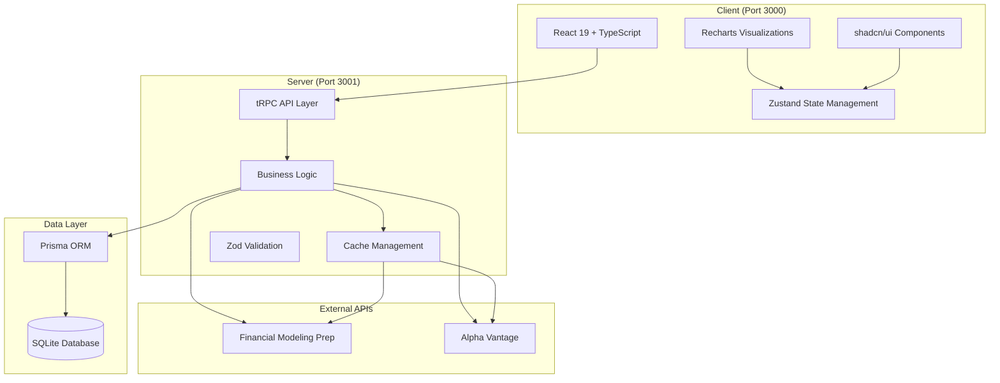
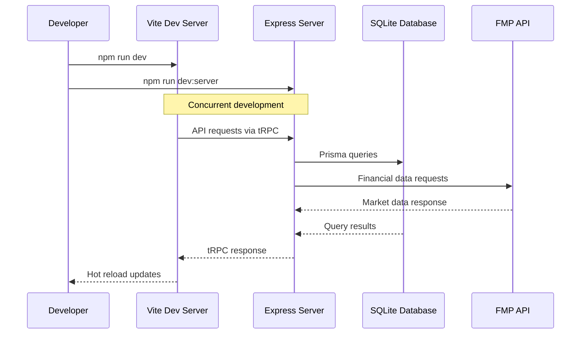
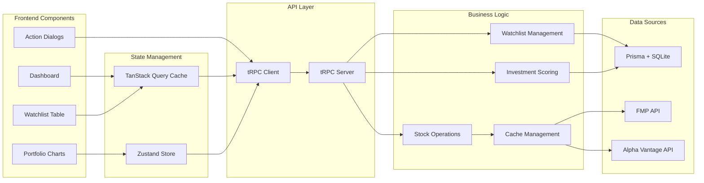
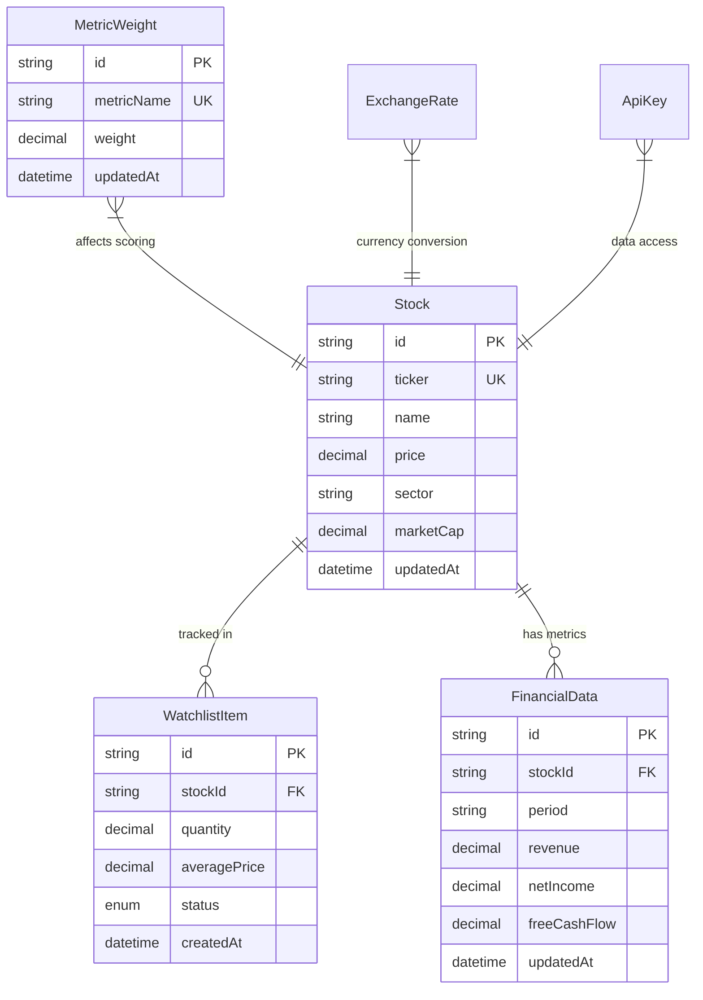

# System Architecture

## Overview

The Investment Tracker is a full-stack TypeScript application built with a modern client-server architecture. It combines real-time financial data integration with sophisticated investment analysis algorithms to provide comprehensive portfolio management capabilities.

## High-Level Architecture



## Technology Stack

### Frontend Technologies

#### Core Framework
- **React 19**: Latest React with improved concurrent features and optimizations
- **TypeScript**: End-to-end type safety from API to UI components
- **Vite**: Fast development server with hot module replacement and optimized builds

#### UI & Styling
- **Tailwind CSS**: Utility-first CSS framework for rapid UI development
- **shadcn/ui**: High-quality, accessible React components built on Radix UI
- **Lucide React**: Beautiful, customizable SVG icons

#### State Management & Data Fetching
- **Zustand**: Lightweight, flexible state management for client-side state
- **TanStack Query (React Query)**: Powerful data synchronization and caching
- **tRPC Client**: Type-safe API client with automatic type inference

#### Data Visualization
- **Recharts**: Composable charting library built on D3.js
- **Custom Chart Components**: Portfolio allocation, performance tracking, trend analysis

### Backend Technologies

#### Server Framework
- **Express.js**: Fast, unopinionated web framework for Node.js
- **tRPC**: End-to-end type-safe APIs with automatic client generation
- **CORS**: Cross-origin resource sharing configuration for frontend integration

#### Data Layer
- **Prisma ORM**: Modern database toolkit with type-safe queries
- **SQLite**: Lightweight, file-based database for development and deployment
- **Database Migrations**: Version-controlled schema evolution

#### Validation & Security
- **Zod**: Runtime type validation and parsing
- **Input Sanitization**: Comprehensive input validation on all endpoints
- **Error Handling**: Structured error responses with proper HTTP status codes

### Development & Testing

#### Build Tools
- **TypeScript Compiler**: Strict type checking across the entire codebase
- **Vite**: Module bundling and development server
- **tsx**: TypeScript execution for server development

#### Testing Framework
- **Vitest**: Fast unit testing with jsdom for DOM simulation
- **Playwright**: End-to-end testing with real browser automation
- **Testing Library**: Component testing utilities for React

#### Code Quality
- **ESLint**: Linting and code style enforcement
- **TypeScript**: Compile-time error checking and IntelliSense
- **Prettier**: Code formatting (configurable)

## Application Flow

### Development Workflow



### Data Flow Architecture



## Component Architecture

### Client-Side Architecture

#### Component Hierarchy
```
App.tsx (Root)
├── tRPC Provider Setup
├── TanStack Query Provider
└── Dashboard.tsx (Main Interface)
    ├── Tabs Navigation
    ├── WatchlistTable.tsx (Portfolio Management)
    │   ├── Stock Rows
    │   ├── Action Buttons
    │   └── Status Indicators
    ├── PortfolioCharts.tsx (Visualizations)
    │   ├── Allocation Charts
    │   ├── Performance Graphs
    │   └── Trend Analysis
    └── Action Dialogs
        ├── AddStockDialog.tsx
        ├── EditWatchlistDialog.tsx
        └── StockDetailDialog.tsx
```

#### State Management Pattern
- **Server State**: Managed by TanStack Query with automatic caching and revalidation
- **UI State**: Local component state for form inputs and UI interactions
- **Global State**: Zustand for cross-component state sharing (minimal usage)

### Server-Side Architecture

#### API Layer Structure
```
server.ts (Express App)
├── CORS Configuration
├── tRPC Middleware
└── Router Mounting

trpc.ts (API Router)
├── Stock Operations
│   ├── CRUD operations
│   ├── Search functionality
│   └── Data enrichment
├── Watchlist Management
│   ├── Add/Remove items
│   ├── Status updates
│   └── Portfolio queries
├── Financial Data
│   ├── Price updates
│   ├── Financial metrics
│   └── Company information
└── Export Operations
    ├── CSV generation
    ├── JSON export
    └── Summary reports
```

## Database Architecture

### Entity Relationship Model



### Data Persistence Strategy

#### Database Configuration
- **SQLite**: Single-file database for simplified deployment
- **Prisma Schema**: Declarative schema definition with migrations
- **Connection Pooling**: Efficient connection management
- **Transaction Support**: ACID compliance for data integrity

#### Migration Strategy
- **Schema Evolution**: Version-controlled database changes
- **Seed Data**: Initial data setup for development and testing
- **Backup Strategy**: Regular database backups for production

## Security Architecture

### API Security

#### Input Validation
- **Zod Schemas**: Runtime validation for all API inputs
- **Type Coercion**: Safe type conversion with validation
- **SQL Injection Prevention**: Parameterized queries via Prisma

#### Error Handling
- **Structured Errors**: Consistent error response format
- **Sensitive Data Protection**: No stack traces or internal details in production
- **Rate Limiting**: API usage limits to prevent abuse

### Environment Security

#### Secret Management
- **SOPS Encryption**: Encrypted environment variable storage
- **API Key Protection**: Secure handling of third-party credentials
- **Environment Separation**: Different configurations for dev/staging/production

## Performance Optimization

### Caching Strategy

#### Client-Side Caching
- **TanStack Query**: Automatic request caching and deduplication
- **Stale-While-Revalidate**: Background data updates for fresh content
- **Cache Invalidation**: Smart cache updates on mutations

#### Server-Side Caching
- **Smart Cache Logic**: Time-based cache invalidation
- **API Rate Limiting**: Efficient external API usage
- **Database Query Optimization**: Indexed queries and eager loading

### Build Optimization

#### Frontend Optimization
- **Code Splitting**: Lazy loading of components and routes
- **Tree Shaking**: Removal of unused code
- **Asset Optimization**: Image and font optimization

#### Backend Optimization
- **Database Indexing**: Optimized query performance
- **Connection Pooling**: Efficient database connections
- **Memory Management**: Optimal memory usage patterns

## Deployment Architecture

### Development Environment
- **Concurrent Servers**: Frontend and backend running simultaneously
- **Hot Reloading**: Instant development feedback
- **Database Seeding**: Consistent development data

### Production Considerations
- **Environment Variables**: Secure configuration management
- **Database Migrations**: Safe schema updates
- **Health Checks**: Application monitoring and alerting
- **Logging**: Comprehensive application logging

## Integration Points

### External API Integration

#### Financial Modeling Prep (FMP)
- **Real-time Quotes**: Current stock prices and market data
- **Financial Statements**: Comprehensive company financials
- **Company Profiles**: Business information and sector data

#### Alpha Vantage
- **Exchange Rates**: Currency conversion data
- **Alternative Data**: Additional financial metrics

### Data Processing Pipeline
- **Symbol Normalization**: Consistent ticker symbol handling
- **Data Validation**: Comprehensive validation of external data
- **Error Recovery**: Graceful handling of API failures
- **Rate Limiting**: Respect for API usage limits