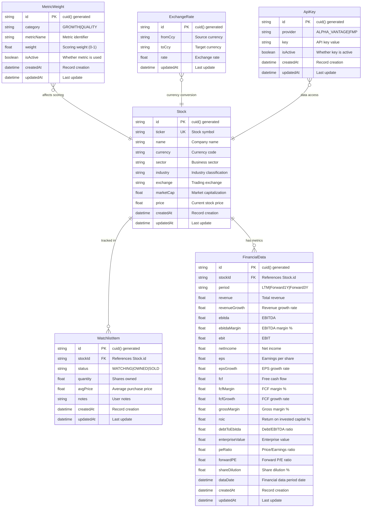

# Data Model Documentation

## Overview

The Investment Tracker uses a SQLite database with Prisma ORM to manage investment portfolio data, financial metrics, and system configuration. The schema is designed for comprehensive stock analysis with support for multiple currencies, configurable scoring weights, and historical financial data tracking.

## Entity Relationship Diagram



## Entity Descriptions

### Stock Entity

The core entity representing publicly traded securities.

#### Fields
- **id**: Primary key using CUID for unique identification
- **ticker**: Unique stock symbol (e.g., "AAPL", "MSFT")
- **name**: Full company name
- **currency**: ISO currency code (defaults to "USD")
- **sector**: Business sector classification (e.g., "Technology", "Healthcare")
- **industry**: Specific industry within sector (e.g., "Software", "Pharmaceuticals")
- **exchange**: Trading exchange (e.g., "NASDAQ", "NYSE")
- **marketCap**: Market capitalization in USD
- **price**: Current stock price in native currency
- **createdAt**: Timestamp of record creation
- **updatedAt**: Timestamp of last modification

#### Relationships
- **One-to-Many** with WatchlistItem (portfolio tracking)
- **One-to-Many** with FinancialData (financial metrics)

#### Constraints
- **ticker** must be unique across all stocks
- **currency** defaults to "USD"
- Cascade deletion removes related watchlist items and financial data

#### Example
```sql
-- Sample Stock record
INSERT INTO Stock (
  id, ticker, name, currency, sector, industry, 
  exchange, marketCap, price, createdAt, updatedAt
) VALUES (
  'clfox123abc', 'AAPL', 'Apple Inc.', 'USD', 'Technology', 
  'Consumer Electronics', 'NASDAQ', 3000000000000, 175.50, 
  '2024-01-01T00:00:00Z', '2024-01-01T12:00:00Z'
);
```

### WatchlistItem Entity

Represents user's investment positions and watchlist tracking.

#### Status Values
- **WATCHING**: Stock is on watchlist but not owned
- **OWNED**: Currently owned position
- **SOLD**: Previously owned but sold position

#### Fields
- **id**: Primary key using CUID
- **stockId**: Foreign key referencing Stock.id
- **status**: Current position status (enum: WATCHING, OWNED, SOLD)
- **quantity**: Number of shares owned (nullable for WATCHING status)
- **avgPrice**: Average purchase price per share (nullable)
- **notes**: User-defined notes about the position
- **createdAt**: Timestamp of record creation
- **updatedAt**: Timestamp of last modification

#### Relationships
- **Many-to-One** with Stock (via stockId)

#### Constraints
- **stockId** is indexed for efficient queries
- Cascade deletion when parent Stock is deleted
- **status** defaults to "WATCHING"

#### Business Logic
- **WATCHING**: quantity and avgPrice should be null
- **OWNED**: quantity should be positive, avgPrice should be set
- **SOLD**: maintains historical record of previous ownership

#### Example
```sql
-- Sample WatchlistItem records
INSERT INTO WatchlistItem (
  id, stockId, status, quantity, avgPrice, notes, createdAt, updatedAt
) VALUES 
  -- Watching position
  ('wl001', 'stock001', 'WATCHING', NULL, NULL, 'Potential buy', '2024-01-01T00:00:00Z', '2024-01-01T00:00:00Z'),
  -- Owned position
  ('wl002', 'stock002', 'OWNED', 100, 150.25, 'Core holding', '2024-01-01T00:00:00Z', '2024-01-01T00:00:00Z'),
  -- Sold position
  ('wl003', 'stock003', 'SOLD', 50, 75.00, 'Took profits', '2024-01-01T00:00:00Z', '2024-01-01T00:00:00Z');
```

### FinancialData Entity

Stores comprehensive financial metrics for investment analysis and scoring.

#### Period Types
- **LTM**: Last Twelve Months (trailing data)
- **Forward1Y**: Forward 1 Year (analyst estimates)
- **Forward3Y**: Forward 3 Year (long-term projections)

#### Core Financial Metrics

##### Revenue Metrics
- **revenue**: Total company revenue
- **revenueGrowth**: Year-over-year revenue growth rate (%)

##### Profitability Metrics
- **ebitda**: Earnings Before Interest, Taxes, Depreciation, and Amortization
- **ebitdaMargin**: EBITDA as percentage of revenue
- **ebit**: Earnings Before Interest and Taxes
- **netIncome**: Bottom-line profit after all expenses
- **grossMargin**: Gross profit as percentage of revenue

##### Per-Share Metrics
- **eps**: Earnings Per Share
- **epsGrowth**: Year-over-year EPS growth rate (%)
- **shareDilution**: Share count change percentage

##### Cash Flow Metrics
- **fcf**: Free Cash Flow (operating cash flow - capital expenditures)
- **fcfMargin**: FCF as percentage of revenue
- **fcfGrowth**: Year-over-year FCF growth rate (%)

##### Efficiency & Quality Metrics
- **roic**: Return on Invested Capital (%)
- **debtToEbitda**: Total debt divided by EBITDA ratio

##### Valuation Metrics
- **enterpriseValue**: Market cap + debt - cash
- **peRatio**: Price-to-Earnings ratio
- **forwardPE**: Forward-looking P/E ratio

#### Relationships
- **Many-to-One** with Stock (via stockId)

#### Constraints
- **Compound index** on (stockId, period) for efficient queries
- **dataDate** represents the period end date for the financial data
- Cascade deletion when parent Stock is deleted

#### Example
```sql
-- Sample FinancialData record (LTM data)
INSERT INTO FinancialData (
  id, stockId, period, revenue, revenueGrowth, ebitda, ebitdaMargin,
  netIncome, eps, epsGrowth, fcf, fcfGrowth, grossMargin, roic,
  debtToEbitda, peRatio, dataDate, createdAt, updatedAt
) VALUES (
  'fd001', 'stock001', 'LTM', 394328000000, 7.8, 123456000000, 31.3,
  99803000000, 6.15, 9.4, 111000000000, 12.1, 43.3, 18.2,
  0.5, 28.5, '2023-12-31T00:00:00Z', '2024-01-01T00:00:00Z', '2024-01-01T00:00:00Z'
);
```

### MetricWeight Entity

Configurable weights for the investment scoring algorithm, allowing customization of scoring emphasis.

#### Categories
- **GROWTH**: Metrics related to company growth (revenue, EPS, FCF growth)
- **QUALITY**: Metrics related to business quality (margins, ROIC, debt ratios)

#### Fields
- **id**: Primary key using CUID
- **category**: Metric category (GROWTH or QUALITY)
- **metricName**: Specific metric identifier
- **weight**: Scoring weight (0.0 to 1.0)
- **isActive**: Whether metric is included in scoring
- **createdAt**: Timestamp of record creation
- **updatedAt**: Timestamp of last modification

#### Constraints
- **Unique constraint** on (category, metricName) combination
- **isActive** defaults to true

#### Supported Metrics

##### Growth Metrics
- **revenueGrowth**: Weight for revenue growth rate
- **epsGrowth**: Weight for earnings growth rate
- **fcfGrowth**: Weight for free cash flow growth

##### Quality Metrics
- **roic**: Weight for return on invested capital
- **netMargin**: Weight for net profit margin
- **fcfMargin**: Weight for free cash flow margin
- **debtToEbitda**: Weight for debt ratio (inverse scoring)

#### Example
```sql
-- Sample MetricWeight records
INSERT INTO MetricWeight (
  id, category, metricName, weight, isActive, createdAt, updatedAt
) VALUES 
  ('mw001', 'GROWTH', 'revenueGrowth', 0.4, true, '2024-01-01T00:00:00Z', '2024-01-01T00:00:00Z'),
  ('mw002', 'GROWTH', 'epsGrowth', 0.35, true, '2024-01-01T00:00:00Z', '2024-01-01T00:00:00Z'),
  ('mw003', 'GROWTH', 'fcfGrowth', 0.25, true, '2024-01-01T00:00:00Z', '2024-01-01T00:00:00Z'),
  ('mw004', 'QUALITY', 'roic', 0.5, true, '2024-01-01T00:00:00Z', '2024-01-01T00:00:00Z'),
  ('mw005', 'QUALITY', 'netMargin', 0.3, true, '2024-01-01T00:00:00Z', '2024-01-01T00:00:00Z'),
  ('mw006', 'QUALITY', 'debtToEbitda', 0.2, true, '2024-01-01T00:00:00Z', '2024-01-01T00:00:00Z');
```

### ExchangeRate Entity

Currency conversion rates for multi-currency portfolio support.

#### Fields
- **id**: Primary key using CUID
- **fromCcy**: Source currency (ISO 4217 code)
- **toCcy**: Target currency (ISO 4217 code)
- **rate**: Exchange rate (1 fromCcy = rate toCcy)
- **updatedAt**: Timestamp of last rate update

#### Constraints
- **Unique constraint** on (fromCcy, toCcy) combination
- Rates are typically updated daily or on-demand

#### Example
```sql
-- Sample ExchangeRate records
INSERT INTO ExchangeRate (
  id, fromCcy, toCcy, rate, updatedAt
) VALUES 
  ('er001', 'EUR', 'USD', 1.0854, '2024-01-01T12:00:00Z'),
  ('er002', 'GBP', 'USD', 1.2734, '2024-01-01T12:00:00Z'),
  ('er003', 'JPY', 'USD', 0.0071, '2024-01-01T12:00:00Z');
```

### ApiKey Entity

Secure storage for external API credentials.

#### Supported Providers
- **FMP**: Financial Modeling Prep (primary financial data source)
- **ALPHA_VANTAGE**: Alpha Vantage (exchange rates and alternative data)

#### Fields
- **id**: Primary key using CUID
- **provider**: API provider identifier (unique)
- **key**: Encrypted API key value
- **isActive**: Whether the key is currently active
- **createdAt**: Timestamp of record creation
- **updatedAt**: Timestamp of last modification

#### Security Considerations
- Keys should be encrypted at rest
- Access should be limited to server-side operations only
- Regular rotation of API keys is recommended

#### Example
```sql
-- Sample ApiKey records
INSERT INTO ApiKey (
  id, provider, key, isActive, createdAt, updatedAt
) VALUES 
  ('ak001', 'FMP', 'encrypted_fmp_key_here', true, '2024-01-01T00:00:00Z', '2024-01-01T00:00:00Z'),
  ('ak002', 'ALPHA_VANTAGE', 'encrypted_av_key_here', true, '2024-01-01T00:00:00Z', '2024-01-01T00:00:00Z');
```

## Database Performance Optimization

### Indexing Strategy

#### Primary Indexes
- All entities use CUID primary keys for optimal performance
- Unique constraints on critical fields (ticker, provider, currency pairs)

#### Secondary Indexes
- **WatchlistItem.stockId**: Optimizes portfolio queries
- **FinancialData.(stockId, period)**: Compound index for financial data queries

#### Query Optimization
- Use of `include` and `select` in Prisma queries to minimize data transfer
- Pagination for large result sets
- Efficient `orderBy` clauses leveraging indexes

### Data Integrity

#### Referential Integrity
- Foreign key constraints ensure data consistency
- Cascade deletions maintain referential integrity
- Unique constraints prevent duplicate records

#### Data Validation
- Prisma schema validation at database level
- Zod validation at application level
- Type safety through TypeScript

## Migration Strategy

### Schema Evolution
```bash
# Generate migration for schema changes
npx prisma migrate dev --name descriptive_migration_name

# Apply migrations to production
npx prisma migrate deploy

# Generate Prisma client after schema changes
npx prisma generate
```

### Seed Data
```bash
# Populate initial data
npm run db:seed
```

### Backup and Recovery
```bash
# Backup SQLite database
cp prisma/dev.db backup/dev_backup_$(date +%Y%m%d).db

# Restore from backup
cp backup/dev_backup_20240101.db prisma/dev.db
```

## Best Practices

### Data Modeling
1. **Normalize appropriately**: Balance between normalization and query performance
2. **Use meaningful relationships**: Leverage foreign keys and cascade behaviors
3. **Design for scalability**: Consider future growth in data volume

### Performance
1. **Index strategically**: Create indexes for frequently queried fields
2. **Optimize queries**: Use efficient Prisma query patterns
3. **Monitor performance**: Track slow queries and optimize as needed

### Security
1. **Encrypt sensitive data**: API keys and other sensitive information
2. **Validate inputs**: Comprehensive validation at all entry points
3. **Audit access**: Log database access and modifications

### Maintenance
1. **Regular backups**: Automated backup procedures
2. **Migration testing**: Test schema changes in staging environment
3. **Performance monitoring**: Regular analysis of query performance