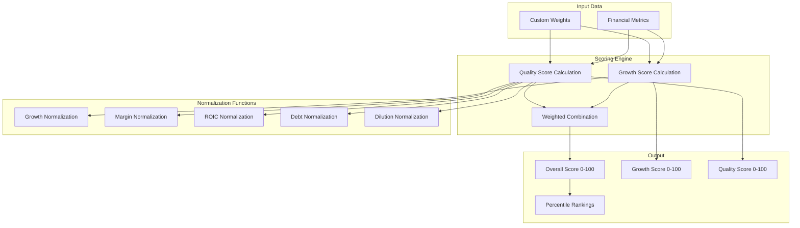

# Investment Scoring Algorithm

## Overview

The Investment Tracker features a sophisticated proprietary scoring engine that evaluates stocks across multiple financial dimensions to provide quantitative investment analysis. The algorithm combines growth and quality metrics with configurable weights to generate comprehensive investment scores ranging from 0 to 100.

## Algorithm Architecture



## Core Components

### InvestmentScoringEngine Class

The main class that orchestrates the scoring process with configurable weights and comprehensive metric analysis.

#### Constructor
```typescript
constructor(customWeights?: MetricWeight[])
```

Initializes the scoring engine with optional custom weights. If no custom weights are provided, uses default weightings optimized for balanced growth-quality analysis.

#### Key Methods

##### calculateOverallScore()
```typescript
calculateOverallScore(
  metrics: FinancialMetrics, 
  growthWeight: number = 0.6, 
  qualityWeight: number = 0.4
): {
  growthScore: number
  qualityScore: number
  overallScore: number
}
```

Primary scoring method that combines growth and quality scores with configurable category weights.

## Growth Metrics Analysis

Growth metrics assess a company's ability to expand revenue, earnings, and cash flow over time. The algorithm emphasizes forward-looking growth projections while incorporating historical performance.

### Supported Growth Metrics

#### Default Weight Distribution
```typescript
private growthWeights: Record<string, number> = {
  LTM_REVENUE_GROWTH: 0.10,      // 10% - Historical revenue growth
  LTM_FCF_GROWTH: 0.10,          // 10% - Free cash flow growth
  LTM_EPS_GROWTH: 0.10,          // 10% - Earnings per share growth
  FORWARD_3Y_REVENUE_GROWTH: 0.25, // 25% - Projected revenue growth
  FORWARD_3Y_EPS_GROWTH: 0.45,   // 45% - Projected earnings growth
}
```

#### Metric Definitions

##### Last Twelve Months (LTM) Revenue Growth
- **Purpose**: Measures recent revenue expansion capability
- **Calculation**: (Current LTM Revenue - Prior LTM Revenue) / Prior LTM Revenue
- **Weight**: 10% of growth score
- **Expected Range**: -20% to +50% annually

##### LTM Free Cash Flow Growth
- **Purpose**: Assesses cash generation improvement
- **Calculation**: (Current LTM FCF - Prior LTM FCF) / Prior LTM FCF
- **Weight**: 10% of growth score
- **Expected Range**: -30% to +40% annually

##### LTM Earnings Per Share Growth
- **Purpose**: Evaluates bottom-line profit expansion
- **Calculation**: (Current LTM EPS - Prior LTM EPS) / Prior LTM EPS
- **Weight**: 10% of growth score
- **Expected Range**: -50% to +100% annually

##### Forward 3-Year Revenue Growth (Projected)
- **Purpose**: Captures analyst expectations for revenue expansion
- **Calculation**: Compound Annual Growth Rate over 3-year forecast period
- **Weight**: 25% of growth score (highest weight for future potential)
- **Expected Range**: 0% to +30% CAGR

##### Forward 3-Year EPS Growth (Projected)
- **Purpose**: Measures expected earnings expansion potential
- **Calculation**: Compound Annual Growth Rate for earnings over 3 years
- **Weight**: 45% of growth score (emphasis on profit growth)
- **Expected Range**: 0% to +25% CAGR

### Growth Score Calculation

```typescript
calculateGrowthScore(metrics: FinancialMetrics): number {
  const availableMetrics: { score: number; weight: number }[] = []
  
  // Process each available growth metric
  if (metrics.ltmRevenueGrowth !== undefined) {
    const normalizedScore = this.normalizeGrowthMetric(metrics.ltmRevenueGrowth)
    availableMetrics.push({
      score: normalizedScore,
      weight: this.growthWeights.LTM_REVENUE_GROWTH
    })
  }
  
  // ... process other metrics
  
  // Calculate weighted average, re-normalizing for missing metrics
  const totalAvailableWeight = availableMetrics.reduce((sum, metric) => sum + metric.weight, 0)
  const weightedScore = availableMetrics.reduce((sum, metric) => {
    const normalizedWeight = metric.weight / totalAvailableWeight
    return sum + (metric.score * normalizedWeight)
  }, 0)
  
  return weightedScore
}
```

#### Growth Normalization Function

```typescript
private normalizeGrowthMetric(growth: number): number {
  // Growth rate normalization mapping:
  // - 20%+ growth = 1.0 (excellent)
  // - 0% growth = 0.5 (neutral)
  // - Negative growth = 0.0-0.5 (poor to neutral)
  
  if (growth >= 0.2) return 1.0
  if (growth >= 0) return 0.5 + (growth / 0.4) // Linear scale 0-20%
  return Math.max(0, 0.5 + (growth / 0.4))     // Negative growth penalty
}
```

## Quality Metrics Analysis

Quality metrics evaluate the operational efficiency, profitability, and financial health of a company. These metrics assess how well a company converts revenue into profit and manages its capital structure.

### Supported Quality Metrics

#### Default Weight Distribution
```typescript
private qualityWeights: Record<string, number> = {
  LTM_GROSS_MARGIN: 0.25,        // 25% - Pricing power and efficiency
  LTM_ROIC: 0.30,               // 30% - Capital efficiency (highest weight)
  LTM_DEBT_TO_EBITDA: 0.20,     // 20% - Financial leverage
  LTM_FCF_MARGIN: 0.20,         // 20% - Cash conversion efficiency
  SHARE_DILUTION: 0.05,         // 5% - Shareholder dilution protection
}
```

#### Metric Definitions

##### LTM Gross Margin
- **Purpose**: Measures pricing power and operational efficiency
- **Calculation**: (Revenue - Cost of Goods Sold) / Revenue
- **Weight**: 25% of quality score
- **Expected Range**: 20% to 80% depending on industry
- **Normalization**: Linear scale where 50% = 1.0 score

##### LTM Return on Invested Capital (ROIC)
- **Purpose**: Evaluates management's efficiency in deploying capital
- **Calculation**: Net Operating Profit After Tax / Invested Capital
- **Weight**: 30% of quality score (highest emphasis)
- **Expected Range**: 5% to 25%
- **Normalization**: 15%+ ROIC = 1.0 score (excellent capital efficiency)

##### LTM Debt-to-EBITDA Ratio
- **Purpose**: Assesses financial leverage and debt management
- **Calculation**: Total Debt / EBITDA
- **Weight**: 20% of quality score
- **Expected Range**: 0x to 5x (lower is better)
- **Normalization**: Inverse scoring where 0x = 1.0, 3x+ = 0.0

##### LTM Free Cash Flow Margin
- **Purpose**: Measures ability to convert revenue to cash
- **Calculation**: Free Cash Flow / Revenue
- **Weight**: 20% of quality score
- **Expected Range**: 5% to 30%
- **Normalization**: Linear scale where 50% = 1.0 score

##### Share Dilution
- **Purpose**: Protects against management destroying shareholder value
- **Calculation**: (Current Shares - Prior Shares) / Prior Shares
- **Weight**: 5% of quality score
- **Expected Range**: -10% to +5% (negative is dilutive)
- **Normalization**: 0% dilution = 1.0, -10%+ dilution = 0.0

### Quality Score Calculation

```typescript
calculateQualityScore(metrics: FinancialMetrics): number {
  const availableMetrics: { score: number; weight: number }[] = []
  
  // LTM ROIC (30% weight - highest quality indicator)
  if (metrics.ltmRoic !== undefined) {
    availableMetrics.push({
      score: this.normalizeRoicMetric(metrics.ltmRoic),
      weight: this.qualityWeights.LTM_ROIC
    })
  }
  
  // ... process other quality metrics
  
  // Re-weight available metrics to maintain scoring consistency
  const totalAvailableWeight = availableMetrics.reduce((sum, metric) => sum + metric.weight, 0)
  const weightedScore = availableMetrics.reduce((sum, metric) => {
    const normalizedWeight = metric.weight / totalAvailableWeight
    return sum + (metric.score * normalizedWeight)
  }, 0)
  
  return weightedScore
}
```

## Normalization Functions

Each metric type uses specialized normalization to convert raw financial data into comparable 0-1 scores.

### Margin Normalization
```typescript
private normalizeMarginMetric(margin: number): number {
  // Maps margin percentages to 0-1 scale
  // Assumes 50% margin represents excellent performance (score = 1.0)
  return Math.min(1.0, Math.max(0, margin / 0.5))
}
```

### ROIC Normalization
```typescript
private normalizeRoicMetric(roic: number): number {
  // 15%+ ROIC considered excellent capital efficiency
  // Linear scaling from 0% to 15%
  return Math.min(1.0, Math.max(0, roic / 0.15))
}
```

### Debt Normalization (Inverse Scoring)
```typescript
private normalizeDebtMetric(debtToEbitda: number): number {
  // Lower debt ratios receive higher scores
  // 0x debt = 1.0 score, 3x+ debt = 0.0 score
  if (debtToEbitda <= 0) return 1.0
  if (debtToEbitda >= 3) return 0.0
  return 1.0 - (debtToEbitda / 3)
}
```

### Share Dilution Normalization (Inverse Scoring)
```typescript
private normalizeDilutionMetric(dilution: number): number {
  // Negative dilution (share buybacks) = good
  // Positive dilution (share issuance) = bad
  if (dilution >= 0) return 1.0
  if (dilution <= -10) return 0.0
  return 1.0 + (dilution / 10) // Linear penalty for dilution
}
```

## Overall Score Calculation

The final investment score combines growth and quality components with configurable category weights.

### Default Category Weights
- **Growth Weight**: 60% (emphasizes future potential)
- **Quality Weight**: 40% (ensures fundamental soundness)

### Score Calculation Formula
```typescript
overallScore = (growthScore × growthWeight) + (qualityScore × qualityWeight)
```

### Example Calculation

Given a stock with the following metrics:
```typescript
const metrics: FinancialMetrics = {
  ltmRevenueGrowth: 0.15,        // 15% revenue growth
  forward3yEpsGrowth: 0.20,      // 20% projected EPS growth
  ltmRoic: 0.18,                 // 18% ROIC
  ltmGrossMargin: 0.45,          // 45% gross margin
  ltmDebtToEbitda: 1.2,          // 1.2x debt ratio
}
```

**Growth Score Calculation:**
1. LTM Revenue Growth: 15% → normalized to 0.875 (between 0% and 20%)
2. Forward 3Y EPS Growth: 20% → normalized to 1.0 (excellent)
3. Weighted Growth Score: (0.875 × 0.1 + 1.0 × 0.45) / (0.1 + 0.45) = 0.98

**Quality Score Calculation:**
1. ROIC: 18% → normalized to 1.0 (above 15% threshold)
2. Gross Margin: 45% → normalized to 0.90 (90% of 50% benchmark)
3. Debt Ratio: 1.2x → normalized to 0.60 (good debt management)
4. Weighted Quality Score: (1.0 × 0.3 + 0.90 × 0.25 + 0.60 × 0.2) / (0.3 + 0.25 + 0.2) = 0.86

**Overall Score:**
```
Overall Score = (0.98 × 0.6) + (0.86 × 0.4) = 0.93 → 93/100
```

## Ranking and Percentile Analysis

### Stock Ranking Functions

```typescript
static rankStocks(stocksWithScores: Array<{
  ticker: string, 
  scores: ReturnType<InvestmentScoringEngine['calculateOverallScore']>
}>) {
  return {
    topOverall: stocks.sort((a, b) => b.scores.overallScore - a.scores.overallScore).slice(0, 10),
    topGrowth: stocks.sort((a, b) => b.scores.growthScore - a.scores.growthScore).slice(0, 10),
    topQuality: stocks.sort((a, b) => b.scores.qualityScore - a.scores.qualityScore).slice(0, 10),
  }
}
```

### Percentile Calculations

```typescript
static calculatePercentiles(values: number[]): Record<number, number> {
  const sorted = [...values].sort((a, b) => a - b)
  const percentiles: Record<number, number> = {}
  
  const percentilePoints = [10, 25, 50, 75, 90]
  percentilePoints.forEach(p => {
    const index = Math.floor((p / 100) * (sorted.length - 1))
    percentiles[p] = sorted[index]
  })
  
  return percentiles
}
```

## Customization and Configuration

### Custom Weight Configuration

The scoring engine supports dynamic weight adjustments through the MetricWeight interface:

```typescript
interface MetricWeight {
  category: string    // 'GROWTH' or 'QUALITY'
  metricName: string  // Specific metric identifier
  weight: number      // Weight value (0.0 to 1.0)
}

// Example: Emphasize profitability over growth
const customWeights: MetricWeight[] = [
  { category: 'GROWTH', metricName: 'FORWARD_3Y_EPS_GROWTH', weight: 0.3 },
  { category: 'QUALITY', metricName: 'LTM_ROIC', weight: 0.5 },
  { category: 'QUALITY', metricName: 'LTM_GROSS_MARGIN', weight: 0.3 },
]

const customEngine = new InvestmentScoringEngine(customWeights)
```

### Weight Categories

#### Growth Category Metrics
- `LTM_REVENUE_GROWTH`: Historical revenue expansion
- `LTM_FCF_GROWTH`: Free cash flow growth
- `LTM_EPS_GROWTH`: Earnings per share growth
- `FORWARD_3Y_REVENUE_GROWTH`: Projected revenue CAGR
- `FORWARD_3Y_EPS_GROWTH`: Projected earnings CAGR

#### Quality Category Metrics
- `LTM_GROSS_MARGIN`: Operational efficiency
- `LTM_ROIC`: Capital deployment efficiency
- `LTM_DEBT_TO_EBITDA`: Financial leverage management
- `LTM_FCF_MARGIN`: Cash conversion capability
- `SHARE_DILUTION`: Shareholder value protection

## Algorithm Validation and Testing

### Unit Test Coverage

The scoring algorithm includes comprehensive unit tests covering:

1. **Normalization Functions**: Verify correct score mapping for edge cases
2. **Weight Calculations**: Ensure proper weight distribution and re-normalization
3. **Missing Data Handling**: Graceful degradation when metrics are unavailable
4. **Custom Weight Application**: Verify custom weights override defaults correctly
5. **Ranking Functions**: Validate correct sorting and percentile calculations

### Test Examples

```typescript
// Test growth normalization
expect(normalizeGrowthMetric(0.20)).toBe(1.0)    // 20% growth = perfect score
expect(normalizeGrowthMetric(0.0)).toBe(0.5)     // 0% growth = neutral
expect(normalizeGrowthMetric(-0.1)).toBe(0.25)   // -10% growth = poor

// Test ROIC normalization
expect(normalizeRoicMetric(0.15)).toBe(1.0)      // 15% ROIC = excellent
expect(normalizeRoicMetric(0.075)).toBe(0.5)     // 7.5% ROIC = average

// Test debt normalization (inverse scoring)
expect(normalizeDebtMetric(0)).toBe(1.0)         // No debt = perfect
expect(normalizeDebtMetric(3)).toBe(0.0)         // 3x debt = poor
```

## Performance Considerations

### Computational Complexity
- **Time Complexity**: O(n) for single stock scoring, O(n log n) for ranking
- **Space Complexity**: O(1) for scoring, O(n) for ranking operations
- **Batch Processing**: Optimized for scoring large portfolios efficiently

### Optimization Strategies
1. **Metric Caching**: Cache normalized scores to avoid recalculation
2. **Lazy Evaluation**: Only calculate scores when metrics are available
3. **Parallel Processing**: Score multiple stocks concurrently
4. **Memory Efficiency**: Minimize object creation during calculations

## Best Practices

### Metric Selection
1. **Data Quality**: Ensure financial data accuracy and recency
2. **Industry Context**: Consider industry-specific metric relevance
3. **Time Consistency**: Use consistent time periods across metrics
4. **Outlier Handling**: Implement bounds checking for extreme values

### Weight Configuration
1. **Investment Strategy Alignment**: Align weights with investment objectives
2. **Backtesting**: Validate weight changes against historical performance
3. **Regular Review**: Periodically reassess weight effectiveness
4. **Documentation**: Maintain clear reasoning for weight decisions

### Integration Patterns
1. **Real-time Scoring**: Update scores when new financial data arrives
2. **Batch Processing**: Efficiently score entire portfolios
3. **Historical Analysis**: Track score evolution over time
4. **Comparative Analysis**: Use percentile rankings for relative assessment