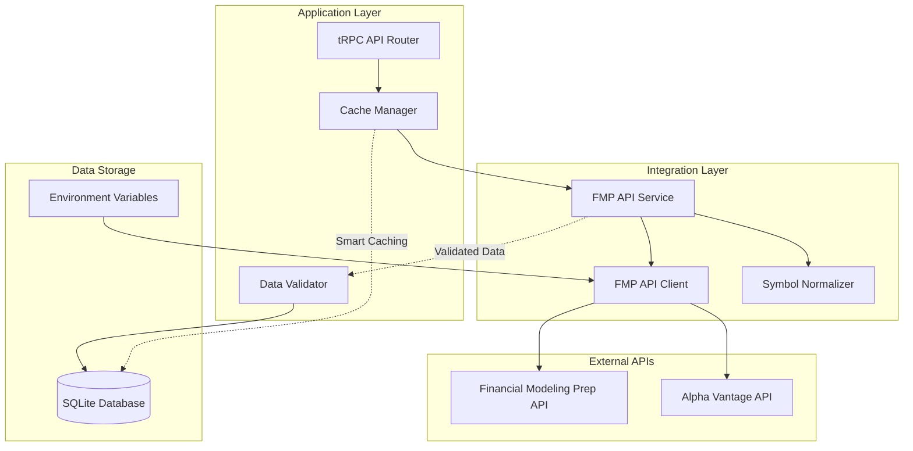

# API Integration Documentation

## Overview

The Investment Tracker integrates with external financial data providers to obtain real-time stock quotes, company profiles, and comprehensive financial statements. The system uses the Financial Modeling Prep (FMP) API as the primary data source, with sophisticated error handling, rate limiting, and data normalization.

## Architecture Overview



## Financial Modeling Prep (FMP) Integration

### FMPFinancialApiService Class

The primary service class that handles all interactions with the Financial Modeling Prep API, providing standardized interfaces for financial data retrieval.

#### Configuration

```typescript
constructor() {
  const apiKey = process.env.FMP_API_KEY
  
  this.client = new FMPApiClient({
    apiKey: apiKey || 'demo',
    baseUrl: 'https://financialmodelingprep.com/api/v3',
    timeout: 10000,
    rateLimit: {
      requestsPerMinute: 300,  // Conservative rate limiting
      burstSize: 10            // Concurrent request limit
    }
  })
}
```

#### Rate Limiting Strategy
- **Requests per minute**: 300 (conservative limit to avoid API throttling)
- **Burst size**: 10 concurrent requests maximum
- **Timeout**: 10 seconds per request
- **Backoff strategy**: Exponential backoff on rate limit errors

### Symbol Normalization

FMP primarily supports US markets, requiring symbol normalization for international tickers.

```typescript
private normalizeSymbol(symbol: string): string {
  // Remove common foreign exchange suffixes
  return symbol.replace(/\.(ST|HK|L|WA|TO|V|DE|PA|MI)$/i, '')
}
```

#### Supported Exchange Suffixes
- **ST**: Stockholm Stock Exchange
- **HK**: Hong Kong Stock Exchange
- **L**: London Stock Exchange
- **WA**: Warsaw Stock Exchange
- **TO**: Toronto Stock Exchange
- **V**: TSX Venture Exchange
- **DE**: XETRA (Deutsche Börse)
- **PA**: Euronext Paris
- **MI**: Borsa Italiana

### Data Retrieval Methods

#### Stock Quote Retrieval

```typescript
async getStockQuote(symbol: string): Promise<StockQuote | null> {
  try {
    const normalizedSymbol = this.normalizeSymbol(symbol)
    const quotes = await this.client.quotes.getRealTimeQuote(normalizedSymbol)
    
    if (!quotes || !Array.isArray(quotes) || quotes.length === 0) {
      return null
    }

    const quote = quotes[0]
    return {
      symbol: quote.symbol,
      price: quote.price || 0,
      change: quote.change || 0,
      changePercent: quote.changesPercentage || 0,
      marketCap: quote.marketCap
    }
  } catch (error) {
    console.error(`Error fetching quote for ${symbol}:`, error)
    return null
  }
}
```

**Response Format:**
```typescript
interface StockQuote {
  symbol: string           // Normalized ticker symbol
  price: number           // Current stock price
  change: number          // Absolute price change
  changePercent: number   // Percentage price change
  marketCap?: number      // Market capitalization
}
```

#### Company Profile Retrieval

```typescript
async getCompanyProfile(symbol: string): Promise<CompanyProfile | null> {
  try {
    const normalizedSymbol = this.normalizeSymbol(symbol)
    const profile = await this.client.companies.getProfile(normalizedSymbol)
    
    if (!profile) {
      return null
    }

    return {
      symbol: profile.symbol,
      name: profile.companyName,
      currency: profile.currency || 'USD',
      exchange: profile.exchangeShortName || 'Unknown',
      industry: profile.industry,
      sector: profile.sector,
      marketCap: typeof profile.mktCap === 'number' ? profile.mktCap : undefined,
      price: typeof profile.price === 'number' ? profile.price : undefined
    }
  } catch (error) {
    console.error(`Error fetching profile for ${symbol}:`, error)
    return null
  }
}
```

**Response Format:**
```typescript
interface CompanyProfile {
  symbol: string          // Stock ticker symbol
  name: string           // Full company name
  currency: string       // Trading currency (defaults to USD)
  exchange: string       // Exchange identifier
  industry?: string      // Industry classification
  sector?: string        // Sector classification
  marketCap?: number     // Market capitalization
  price?: number         // Current stock price
}
```

#### Symbol Search

```typescript
async searchSymbols(query: string): Promise<SearchResult[]> {
  try {
    const results = await this.client.companies.searchCompanies(query, { limit: 10 })
    
    if (!results || results.length === 0) {
      return []
    }

    return results.map((result) => ({
      ticker: result.symbol,
      name: result.name,
      type: 'Common Stock',
      region: 'US',
      currency: result.currency || 'USD'
    }))
  } catch (error) {
    console.error(`Error searching for \"${query}\":`, error)
    return []
  }
}
```

**Use Cases:**
- Dynamic ticker symbol lookup
- Company name-based search
- Investment idea discovery
- Symbol validation

### Financial Data Retrieval

The most comprehensive method that fetches detailed financial statements and calculates derived metrics.

```typescript
async getFinancialData(symbol: string) {
  try {
    const normalizedSymbol = this.normalizeSymbol(symbol)
    
    // Fetch multiple financial statements
    const incomeStatements = await this.client.financialStatements
      .getIncomeStatements(normalizedSymbol, { period: 'annual', limit: 2 })
    const balanceSheets = await this.client.financialStatements
      .getBalanceSheetStatements(normalizedSymbol, { period: 'annual', limit: 1 })
    const cashFlows = await this.client.financialStatements
      .getCashFlowStatements(normalizedSymbol, { period: 'annual', limit: 2 })
    const ratios = await this.client.ratios
      .getFinancialRatios(normalizedSymbol, { period: 'annual', limit: 1 })

    // Validate data completeness
    if (!incomeStatements?.[0] || !balanceSheets?.[0] || !cashFlows?.[0]) {
      return null
    }

    // Calculate growth rates and derived metrics
    return this.processFinancialData(incomeStatements, balanceSheets, cashFlows, ratios)
  } catch (error) {
    console.error(`Error fetching financial data for ${symbol}:`, error)
    return null
  }
}
```

#### Financial Data Processing

The system calculates various growth rates and financial ratios from raw statement data:

##### Growth Rate Calculations
```typescript
// Revenue Growth (Year-over-Year)
const revenueGrowth = income.revenue && previousIncome?.revenue 
  ? (income.revenue - previousIncome.revenue) / previousIncome.revenue 
  : null

// EPS Growth (Year-over-Year)
const epsGrowth = income.eps && previousIncome?.eps 
  ? (income.eps - previousIncome.eps) / previousIncome.eps 
  : null

// Free Cash Flow Growth
const fcfGrowth = cashFlow.freeCashFlow && previousCashFlow?.freeCashFlow 
  ? (cashFlow.freeCashFlow - previousCashFlow.freeCashFlow) / previousCashFlow.freeCashFlow 
  : null
```

##### Margin Calculations
```typescript
// EBITDA Margin
ebitdaMargin: income.ebitda && income.revenue ? (income.ebitda / income.revenue) : null

// Free Cash Flow Margin
fcfMargin: cashFlow.freeCashFlow && income.revenue ? (cashFlow.freeCashFlow / income.revenue) : null

// Gross Margin
grossMargin: income.grossProfit && income.revenue ? (income.grossProfit / income.revenue) : null
```

##### Financial Health Ratios
```typescript
// Debt-to-EBITDA Ratio
debtToEbitda: balance.totalDebt && income.ebitda ? balance.totalDebt / income.ebitda : null

// Return on Invested Capital (ROIC)
roic: ratio?.roic ? ratio.roic / 100 : null  // Convert percentage to decimal
```

**Complete Response Format:**
```typescript
interface FinancialData {
  symbol: string
  date: string              // Financial statement date
  revenue: number           // Total revenue
  revenueGrowth: number     // YoY revenue growth rate (decimal)
  ebitda: number           // EBITDA
  ebitdaMargin: number     // EBITDA margin (decimal)
  eps: number              // Earnings per share
  epsGrowth: number        // YoY EPS growth rate (decimal)
  fcf: number              // Free cash flow
  fcfMargin: number        // FCF margin (decimal)
  fcfGrowth: number        // YoY FCF growth rate (decimal)
  grossMargin: number      // Gross margin (decimal)
  roic: number             // Return on invested capital (decimal)
  debtToEbitda: number     // Debt-to-EBITDA ratio
  peRatio: number          // Price-to-earnings ratio
  forwardPE: number        // Forward P/E (future implementation)
  shareDilution: number    // Share dilution rate (future implementation)
}
```

## Error Handling and Resilience

### Comprehensive Error Management

```typescript
// Graceful error handling with logging
try {
  const result = await this.client.someMethod(symbol)
  return this.processResult(result)
} catch (error) {
  console.error(`Error fetching data for ${symbol}:`, error)
  
  // Return null rather than throwing to allow graceful degradation
  return null
}
```

### Error Categories

#### Network Errors
- **Timeout errors**: 10-second timeout with retry logic
- **Connection failures**: Network connectivity issues
- **DNS resolution**: API endpoint accessibility problems

#### API Errors
- **Authentication failures**: Invalid or expired API keys
- **Rate limiting**: Exceeded API request limits
- **Quota exhaustion**: Monthly/daily usage limits reached

#### Data Quality Issues
- **Missing data**: Incomplete financial statements
- **Invalid symbols**: Non-existent or delisted securities
- **Format errors**: Unexpected response structures

### Resilience Strategies

#### Graceful Degradation
- **Partial data handling**: Process available metrics even if some are missing
- **Fallback values**: Use reasonable defaults for missing fields
- **Progressive enhancement**: Add features as data becomes available

#### Retry Logic
```typescript
// Implemented in FMP API Client
rateLimit: {
  requestsPerMinute: 300,
  burstSize: 10,
  retryAfter: 60000,        // Wait 1 minute after rate limit
  maxRetries: 3             // Maximum retry attempts
}
```

## Data Validation and Transformation

### Input Validation

#### Symbol Validation
```typescript
private validateSymbol(symbol: string): boolean {
  // Basic symbol format validation
  return /^[A-Z]{1,5}(\.[A-Z]{1,3})?$/.test(symbol.toUpperCase())
}
```

#### Data Type Validation
```typescript
// Ensure numeric values are properly typed
const safeNumber = (value: any): number | null => {
  const num = Number(value)
  return isNaN(num) ? null : num
}
```

### Data Transformation

#### Percentage Normalization
```typescript
// Convert percentages to decimals for consistent calculation
const normalizePercentage = (percentage: number): number => {
  return percentage > 1 ? percentage / 100 : percentage
}
```

#### Currency Handling
```typescript
// Standardize currency values
const normalizeCurrency = (value: number, currency: string): number => {
  // Convert to USD base currency if needed
  return currency === 'USD' ? value : value * getExchangeRate(currency, 'USD')
}
```

## Integration with Application Layer

### tRPC Integration

The FMP service integrates seamlessly with the tRPC API layer:

```typescript
// Stock quote refresh endpoint
refreshStockQuote: publicProcedure
  .input(z.object({ ticker: z.string() }))
  .mutation(async ({ input }) => {
    const quote = await fmpFinancialApi.getStockQuote(input.ticker)
    
    if (!quote) {
      throw new Error(`Failed to fetch quote for ${input.ticker}`)
    }
    
    // Update database with fresh quote data
    return await db.stock.update({
      where: { ticker: input.ticker },
      data: {
        price: quote.price,
        marketCap: quote.marketCap,
        updatedAt: new Date()
      }
    })
  })
```

### Database Integration

Financial data flows from the API service through validation into the database:

```typescript
// Store processed financial data
const financialRecord = await db.financialData.upsert({
  where: {
    stockId_period: {
      stockId: stock.id,
      period: 'annual'
    }
  },
  update: {
    revenue: financialData.revenue,
    revenueGrowth: financialData.revenueGrowth,
    eps: financialData.eps,
    epsGrowth: financialData.epsGrowth,
    // ... other metrics
    updatedAt: new Date()
  },
  create: {
    stockId: stock.id,
    period: 'annual',
    // ... financial metrics
    dataDate: new Date(financialData.date),
    createdAt: new Date(),
    updatedAt: new Date()
  }
})
```

## Performance Optimization

### Caching Strategy

The API integration works with the caching system to minimize external API calls:

```typescript
// Check cache before making API call
const needsRefresh = shouldRefreshPriceData(stock.updatedAt)
if (!needsRefresh) {
  console.log(`Price data for ${stock.ticker} is fresh, skipping API call`)
  return stock
}

// Fetch fresh data only when needed
const quote = await fmpFinancialApi.getStockQuote(stock.ticker)
```

### Batch Processing

Efficient batch processing for multiple stocks:

```typescript
// Process stocks in batches to respect rate limits
const batchSize = 10
const batches = chunk(stocks, batchSize)

for (const batch of batches) {
  await Promise.all(batch.map(stock => 
    this.updateStockData(stock)
  ))
  
  // Add delay between batches to respect rate limits
  await delay(1000)
}
```

### Connection Pooling

The FMP client uses connection pooling for optimal performance:

```typescript
// HTTP client configuration
const client = new FMPApiClient({
  // ... other options
  httpOptions: {
    keepAlive: true,
    maxSockets: 10,
    timeout: 10000
  }
})
```

## Security Considerations

### API Key Management

```typescript
// Secure API key handling
const apiKey = process.env.FMP_API_KEY
if (!apiKey) {
  console.warn('FMP_API_KEY not found in environment variables')
}

// Never log API keys
console.log(`Making request to FMP API with key: ${apiKey.slice(0, 4)}...`)
```

### Environment Variable Security

API keys are stored in encrypted environment files:

```bash
# Environment variables (encrypted with SOPS)
FMP_API_KEY=your_financial_modeling_prep_api_key
FMP_DATA_KEY=your_fmp_data_api_key
ALPHA_VANTAGE_API_KEY=your_alpha_vantage_api_key
```

### Input Sanitization

All user inputs are sanitized before making API calls:

```typescript
// Sanitize ticker symbols
const sanitizeSymbol = (symbol: string): string => {
  return symbol.toUpperCase().replace(/[^A-Z0-9.]/g, '')
}
```

## Monitoring and Logging

### Request Logging

Comprehensive logging for debugging and monitoring:

```typescript
console.log(`Fetching quote for ${symbol} (normalized: ${normalizedSymbol}) from FMP...`)
console.log(`Growth rates for ${symbol}:`, {
  revenueGrowth: revenueGrowth ? `${(revenueGrowth * 100).toFixed(1)}%` : 'N/A',
  epsGrowth: epsGrowth ? `${(epsGrowth * 100).toFixed(1)}%` : 'N/A',
  fcfGrowth: fcfGrowth ? `${(fcfGrowth * 100).toFixed(1)}%` : 'N/A',
})
```

### Error Tracking

Structured error logging for operational monitoring:

```typescript
// Structured error logging
console.error(`Error fetching data for ${symbol}:`, {
  error: error.message,
  stack: error.stack,
  timestamp: new Date().toISOString(),
  endpoint: 'getFinancialData'
})
```

### Performance Metrics

Track API performance and usage:

```typescript
// Request timing and success rate tracking
const startTime = Date.now()
try {
  const result = await apiCall()
  const duration = Date.now() - startTime
  console.log(`API call completed in ${duration}ms`)
  return result
} catch (error) {
  const duration = Date.now() - startTime
  console.error(`API call failed after ${duration}ms:`, error)
  throw error
}
```

## Best Practices

### API Usage Guidelines

1. **Respect Rate Limits**: Stay well below API provider limits
2. **Cache Aggressively**: Minimize redundant API calls
3. **Handle Failures Gracefully**: Never crash the application on API errors
4. **Validate Data**: Always validate external data before storage
5. **Monitor Usage**: Track API calls and costs

### Data Quality Assurance

1. **Completeness Checks**: Verify all required fields are present
2. **Range Validation**: Ensure values are within reasonable ranges
3. **Consistency Checks**: Verify relationships between related metrics
4. **Historical Validation**: Check for unusual changes from previous values

### Error Recovery Strategies

1. **Exponential Backoff**: Gradually increase retry delays
2. **Circuit Breaker**: Stop calling failing APIs temporarily
3. **Fallback Data**: Use cached or estimated data when APIs fail
4. **User Communication**: Inform users of data freshness and reliability