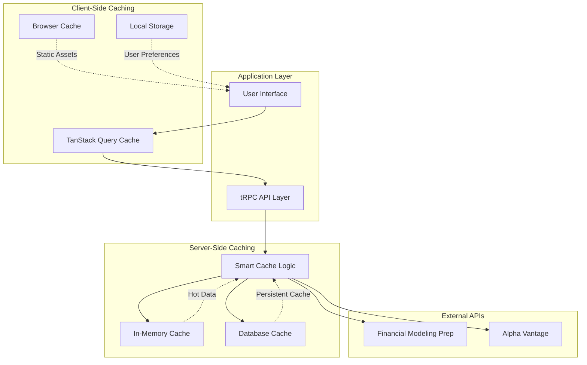

# Caching Strategy Documentation

## Overview

The Investment Tracker implements a sophisticated multi-layered caching system designed to optimize performance, minimize external API costs, and provide responsive user experiences. The system employs intelligent cache invalidation, data freshness tracking, and adaptive refresh strategies.

## Cache Architecture



## Cache Layers

### Client-Side Caching

#### TanStack Query (React Query)
The primary client-side caching mechanism providing automatic request deduplication and background updates.

```typescript
// Default cache configuration
const queryClient = new QueryClient({
  defaultOptions: {
    queries: {
      staleTime: 2 * 60 * 1000,    // 2 minutes - data remains fresh
      cacheTime: 10 * 60 * 1000,   // 10 minutes - cache retention
      refetchOnWindowFocus: false,  // Prevent unnecessary refetches
      refetchOnMount: true,         // Ensure fresh data on component mount
      retry: 3,                     // Retry failed requests
      retryDelay: attemptIndex => Math.min(1000 * 2 ** attemptIndex, 30000)
    }
  }
})
```

**Key Features:**
- **Automatic Deduplication**: Multiple components requesting same data result in single API call
- **Background Updates**: Stale data updated in background while serving cached version
- **Optimistic Updates**: UI updates immediately with rollback on failure
- **Request Coalescing**: Similar requests within time window are batched

#### Browser Cache
Static assets and API responses cached using HTTP headers:

```typescript
// HTTP cache headers for API responses
app.use((req, res, next) => {
  if (req.path.startsWith('/api/')) {
    res.set({
      'Cache-Control': 'private, max-age=120', // 2 minutes for API responses
      'ETag': generateETag(req.url)            // Entity tags for conditional requests
    })
  }
  next()
})
```

### Server-Side Caching

#### Database-Backed Cache
The primary caching mechanism using database timestamps and intelligent refresh logic.

##### Cache Configuration
```typescript
// Cache duration constants
const CACHE_DURATIONS = {
  PRICE_DATA: 2,      // 2 hours for stock prices
  FINANCIAL_DATA: 12, // 12 hours for financial statements
  COMPANY_DATA: 24,   // 24 hours for company profiles
  EXCHANGE_RATES: 6,  // 6 hours for currency rates
  SEARCH_RESULTS: 1   // 1 hour for symbol search
} as const
```

#### Smart Cache Logic

The cache system uses utility functions to determine data freshness and refresh requirements:

```typescript
/**
 * Core cache validation function
 */
export function isDataStale(timestamp: Date | null | undefined, maxAgeHours: number): boolean {
  if (!timestamp) {
    return true // No timestamp means data is missing, needs refresh
  }

  const now = new Date()
  const ageInHours = (now.getTime() - timestamp.getTime()) / (1000 * 60 * 60)
  
  return ageInHours > maxAgeHours
}

/**
 * Price data cache validation (2-hour cache)
 */
export function shouldRefreshPriceData(updatedAt: Date | null | undefined): boolean {
  return isDataStale(updatedAt, 2)
}

/**
 * Financial data cache validation (12-hour cache)
 */
export function shouldRefreshFinancialData(updatedAt: Date | null | undefined): boolean {
  return isDataStale(updatedAt, 12)
}
```

### Cache Strategies by Data Type

#### Stock Price Data
**Cache Duration**: 2 hours  
**Rationale**: Prices change frequently during market hours but don't need real-time updates for portfolio analysis

```typescript
// Smart price refresh implementation
refreshAllWatchlistPrices: publicProcedure
  .mutation(async () => {
    const watchlistStocks = await db.stock.findMany({
      where: {
        watchlistItems: {
          some: { status: { in: ['WATCHING', 'OWNED'] } }
        }
      },
      select: {
        id: true,
        ticker: true,
        price: true,
        marketCap: true,
        updatedAt: true
      }
    })

    // Filter stocks that need price updates based on cache rules
    const stocksNeedingUpdate = watchlistStocks.filter(stock => 
      shouldRefreshPriceData(stock.updatedAt)
    )

    const summary = getUpdateSummary(watchlistStocks, 'price')
    
    console.log(`Price cache summary:`, {
      total: summary.total,
      needsUpdate: summary.needsUpdate,
      fresh: summary.fresh,
      stocksToUpdate: stocksNeedingUpdate.map(s => s.ticker)
    })

    if (stocksNeedingUpdate.length === 0) {
      console.log('All price data is fresh, skipping API calls')
      return {
        updated: [],
        skipped: watchlistStocks.length,
        totalStocks: watchlistStocks.length,
        message: 'All price data is already fresh (updated within 2 hours)'
      }
    }

    // Proceed with API calls only for stale data
    const results = await this.updateStockPrices(stocksNeedingUpdate)
    
    return {
      updated: results,
      skipped: watchlistStocks.length - stocksNeedingUpdate.length,
      totalStocks: watchlistStocks.length,
      message: `Smart refresh: Updated ${results.length} stale stocks, ${stocksNeedingUpdate.length} were already fresh`
    }
  })
```

#### Financial Statement Data
**Cache Duration**: 12 hours  
**Rationale**: Financial statements are typically updated quarterly/annually, 12-hour cache provides fresh data without excessive API usage

```typescript
// Smart financial data refresh
refreshAllFinancialData: publicProcedure
  .mutation(async () => {
    const watchlistStocks = await db.stock.findMany({
      where: {
        watchlistItems: {
          some: { status: { in: ['WATCHING', 'OWNED'] } }
        }
      },
      include: {
        financialData: {
          where: { period: 'annual' },
          orderBy: { updatedAt: 'desc' },
          take: 1
        }
      }
    })

    // Filter stocks that need financial data updates
    const stocksNeedingUpdate = watchlistStocks.filter(stock => {
      const latestFinancialData = stock.financialData[0]
      return shouldRefreshFinancialData(latestFinancialData?.updatedAt)
    })

    const summary = getUpdateSummary(watchlistStocks, 'financial')
    
    if (stocksNeedingUpdate.length === 0) {
      return {
        updated: [],
        skipped: watchlistStocks.length,
        totalStocks: watchlistStocks.length,
        message: 'All financial data is already fresh (updated within 12 hours)'
      }
    }

    // Fetch fresh financial data for stale records
    const results = await this.updateFinancialData(stocksNeedingUpdate)
    
    return {
      updated: results,
      skipped: watchlistStocks.length - stocksNeedingUpdate.length,
      totalStocks: watchlistStocks.length,
      message: `Smart refresh: Updated ${results.length} stale stocks, ${stocksNeedingUpdate.length} were already fresh`
    }
  })
```

#### Company Profile Data
**Cache Duration**: 24 hours  
**Rationale**: Company information (sector, industry, exchange) changes infrequently

```typescript
// Smart company data enrichment
enrichAllStockData: publicProcedure
  .mutation(async () => {
    // Find stocks with missing or stale company data
    const stocks = await db.stock.findMany({
      where: {
        OR: [
          { sector: null },
          { exchange: null },
          { industry: null },
          { marketCap: null },
          // Also include stocks that haven't been updated in 24 hours
          {
            updatedAt: {
              lt: new Date(Date.now() - 24 * 60 * 60 * 1000)
            }
          }
        ]
      }
    })

    // Filter stocks that actually need enrichment
    const stocksNeedingEnrichment = stocks.filter(stock => {
      const hasIncompleteData = !stock.sector || !stock.exchange || !stock.industry || !stock.marketCap
      const isStale = shouldRefreshPriceData(stock.updatedAt) // Use 2-hour cache for metadata updates
      
      return hasIncompleteData || isStale
    })

    if (stocksNeedingEnrichment.length === 0) {
      return {
        updated: [],
        skipped: stocks.length,
        totalStocks: stocks.length,
        message: 'All stock data is already complete and fresh'
      }
    }

    // Enrich only the stocks that need it
    const results = await this.enrichStockData(stocksNeedingEnrichment)
    
    return {
      updated: results,
      skipped: stocks.length - stocksNeedingEnrichment.length,
      totalStocks: stocks.length,
      message: `Smart enrichment: Updated ${results.length} stocks, ${stocksNeedingEnrichment.length} were already complete and fresh`
    }
  })
```

## Cache Performance Monitoring

### Cache Status Tracking

```typescript
/**
 * Get detailed cache status for monitoring and debugging
 */
export function getCacheStatus(timestamp: Date | null | undefined, maxAgeHours: number): {
  status: 'missing' | 'fresh' | 'stale'
  description: string
  ageHours?: number
} {
  if (!timestamp) {
    return {
      status: 'missing',
      description: 'No data available'
    }
  }

  const now = new Date()
  const ageInHours = (now.getTime() - timestamp.getTime()) / (1000 * 60 * 60)
  
  if (ageInHours > maxAgeHours) {
    return {
      status: 'stale',
      description: `Data is ${Math.floor(ageInHours)} hours old`,
      ageHours: ageInHours
    }
  }

  return {
    status: 'fresh',
    description: `Updated ${Math.floor(ageInHours)} hours ago`,
    ageHours: ageInHours
  }
}
```

### Update Summary Analytics

```typescript
/**
 * Calculate comprehensive update summaries for monitoring
 */
export function getUpdateSummary(
  stocks: Array<{ 
    ticker: string
    updatedAt?: Date | null
    financialData?: Array<{ updatedAt?: Date | null }> | null
  }>,
  checkType: 'price' | 'financial'
): {
  total: number
  needsUpdate: number
  fresh: number
  needsUpdateTickers: string[]
  freshTickers: string[]
} {
  const needsUpdateTickers: string[] = []
  const freshTickers: string[] = []

  stocks.forEach(stock => {
    let needsUpdate = false

    if (checkType === 'price') {
      needsUpdate = shouldRefreshPriceData(stock.updatedAt)
    } else if (checkType === 'financial') {
      const latestFinancialData = stock.financialData?.[0]
      needsUpdate = shouldRefreshFinancialData(latestFinancialData?.updatedAt)
    }

    if (needsUpdate) {
      needsUpdateTickers.push(stock.ticker)
    } else {
      freshTickers.push(stock.ticker)
    }
  })

  return {
    total: stocks.length,
    needsUpdate: needsUpdateTickers.length,
    fresh: freshTickers.length,
    needsUpdateTickers,
    freshTickers
  }
}
```

### Human-Readable Time Formatting

```typescript
/**
 * Format timestamps for user-friendly display
 */
export function formatTimeSince(timestamp: Date | null | undefined): string {
  if (!timestamp) {
    return 'Never'
  }

  const now = new Date()
  const diffMs = now.getTime() - timestamp.getTime()
  const diffHours = Math.floor(diffMs / (1000 * 60 * 60))
  const diffMinutes = Math.floor((diffMs % (1000 * 60 * 60)) / (1000 * 60))

  if (diffHours >= 24) {
    const days = Math.floor(diffHours / 24)
    return `${days} day${days !== 1 ? 's' : ''} ago`
  } else if (diffHours >= 1) {
    return `${diffHours} hour${diffHours !== 1 ? 's' : ''} ago`
  } else if (diffMinutes >= 1) {
    return `${diffMinutes} minute${diffMinutes !== 1 ? 's' : ''} ago`
  } else {
    return 'Just now'
  }
}
```

## Cache Invalidation Strategies

### Time-Based Invalidation
The primary invalidation strategy using configurable time thresholds:

```typescript
// Cache invalidation configuration
const CACHE_CONFIG = {
  price: {
    maxAge: 2,        // Hours
    strategy: 'time'  // Time-based invalidation
  },
  financial: {
    maxAge: 12,       // Hours
    strategy: 'time'
  },
  company: {
    maxAge: 24,       // Hours
    strategy: 'time'
  }
}
```

### Event-Based Invalidation
Invalidate cache based on specific events:

```typescript
// Invalidate cache when stock is added to watchlist
addToWatchlist: publicProcedure
  .input(z.object({ ticker: z.string() }))
  .mutation(async ({ input }) => {
    // Add to watchlist
    const result = await db.watchlistItem.create({
      data: { stockId: stock.id, status: 'WATCHING' }
    })
    
    // Trigger immediate data refresh for new stock
    await fmpFinancialApi.getStockQuote(input.ticker)
    await fmpFinancialApi.getCompanyProfile(input.ticker)
    
    return result
  })
```

### Manual Cache Invalidation
User-triggered cache invalidation for forced refreshes:

```typescript
// Force refresh with cache bypass
refreshAllWatchlistPrices: publicProcedure
  .input(z.object({
    forceRefresh: z.boolean().default(false)
  }).optional().default({}))
  .mutation(async ({ input = {} }) => {
    const { forceRefresh = false } = input

    const watchlistStocks = await db.stock.findMany(/* ... */)

    // Filter based on cache rules or force refresh all
    const stocksNeedingUpdate = forceRefresh 
      ? watchlistStocks 
      : watchlistStocks.filter(stock => shouldRefreshPriceData(stock.updatedAt))

    if (stocksNeedingUpdate.length === 0 && !forceRefresh) {
      return {
        message: 'All price data is already fresh (updated within 2 hours)'
      }
    }

    // Proceed with refresh
    const results = await this.updateStockPrices(stocksNeedingUpdate)
    
    return {
      updated: results,
      message: forceRefresh 
        ? `Force refreshed ${results.length} stocks`
        : `Smart refresh: Updated ${results.length} stale stocks`
    }
  })
```

## Performance Optimization

### Selective Loading
Load only data that's actually needed:

```typescript
// Efficient query with selective loading
const watchlistStocks = await db.stock.findMany({
  where: {
    watchlistItems: {
      some: { status: { in: ['WATCHING', 'OWNED'] } }
    }
  },
  select: {
    id: true,
    ticker: true,
    price: true,
    updatedAt: true,
    // Only load what's needed for cache decision
  }
})
```

### Batch Processing
Process multiple cache operations efficiently:

```typescript
// Batch update multiple stocks
const updateBatch = async (stocks: Stock[]) => {
  const batchSize = 10
  const batches = chunk(stocks, batchSize)
  
  for (const batch of batches) {
    await Promise.all(batch.map(stock => updateStockData(stock)))
    
    // Rate limiting between batches
    await delay(100)
  }
}
```

### Memory Management
Efficient memory usage for cache operations:

```typescript
// Stream processing for large datasets
const processLargeStockList = async (stocks: Stock[]) => {
  for (const stock of stocks) {
    // Process one at a time to control memory usage
    await processStock(stock)
    
    // Clear local references to allow garbage collection
    stock = null
  }
}
```

## Cache Metrics and Monitoring

### Cache Hit Rate Tracking

```typescript
// Cache hit rate metrics
const cacheMetrics = {
  hits: 0,
  misses: 0,
  get hitRate() {
    const total = this.hits + this.misses
    return total > 0 ? (this.hits / total) * 100 : 0
  }
}

const getCachedData = async (key: string) => {
  const cached = await getFromCache(key)
  
  if (cached && !isDataStale(cached.timestamp, cached.maxAge)) {
    cacheMetrics.hits++
    return cached.data
  }
  
  cacheMetrics.misses++
  const fresh = await fetchFreshData(key)
  await storeInCache(key, fresh)
  return fresh
}
```

### Performance Monitoring

```typescript
// Track cache performance metrics
interface CacheMetrics {
  totalRequests: number
  cacheHits: number
  cacheMisses: number
  averageResponseTime: number
  apiCallsSaved: number
}

const trackCachePerformance = (operation: string, duration: number, cacheHit: boolean) => {
  console.log(`Cache ${operation}:`, {
    duration: `${duration}ms`,
    cacheHit,
    timestamp: new Date().toISOString()
  })
}
```

## Best Practices

### Cache Key Design
```typescript
// Consistent cache key patterns
const generateCacheKey = (type: string, identifier: string, params?: Record<string, any>) => {
  const baseKey = `${type}:${identifier}`
  
  if (params) {
    const paramString = Object.entries(params)
      .sort(([a], [b]) => a.localeCompare(b))
      .map(([key, value]) => `${key}=${value}`)
      .join('&')
    return `${baseKey}?${paramString}`
  }
  
  return baseKey
}
```

### Error Handling in Cache Operations
```typescript
// Graceful cache failure handling
const getCachedDataSafely = async (key: string) => {
  try {
    return await getCachedData(key)
  } catch (error) {
    console.error(`Cache operation failed for ${key}:`, error)
    
    // Fallback to direct API call
    return await fetchFreshData(key)
  }
}
```

### Cache Warming Strategies
```typescript
// Proactive cache warming for frequently accessed data
const warmCache = async () => {
  const popularStocks = await db.stock.findMany({
    where: {
      watchlistItems: {
        some: { status: 'OWNED' }
      }
    },
    orderBy: { updatedAt: 'asc' },
    take: 20
  })
  
  // Warm cache for most important stocks
  await Promise.all(
    popularStocks.map(stock => 
      fmpFinancialApi.getStockQuote(stock.ticker)
    )
  )
}
```

### Cache Size Management
```typescript
// Automatic cache cleanup
const cleanupOldCache = async () => {
  const cutoffDate = new Date(Date.now() - 7 * 24 * 60 * 60 * 1000) // 7 days ago
  
  await db.financialData.deleteMany({
    where: {
      updatedAt: {
        lt: cutoffDate
      },
      // Keep only historical data that's still relevant
      period: {
        not: 'annual'
      }
    }
  })
}
```

## Configuration and Tuning

### Environment-Specific Settings
```typescript
// Cache configuration by environment
const getCacheConfig = () => {
  const env = process.env.NODE_ENV
  
  return {
    development: {
      priceCache: 1,     // 1 hour in dev
      financialCache: 6, // 6 hours in dev
      enableLogging: true
    },
    production: {
      priceCache: 2,     // 2 hours in prod
      financialCache: 12,// 12 hours in prod
      enableLogging: false
    }
  }[env] || {
    priceCache: 2,
    financialCache: 12,
    enableLogging: false
  }
}
```

### Dynamic Cache Adjustment
```typescript
// Adjust cache based on market conditions
const getMarketAwareCacheDuration = () => {
  const now = new Date()
  const hour = now.getHours()
  const isMarketHours = hour >= 9 && hour <= 16 // Simplified US market hours
  
  return {
    priceCache: isMarketHours ? 1 : 4, // More frequent updates during market hours
    financialCache: 12 // Financial data doesn't change based on market hours
  }
}
```