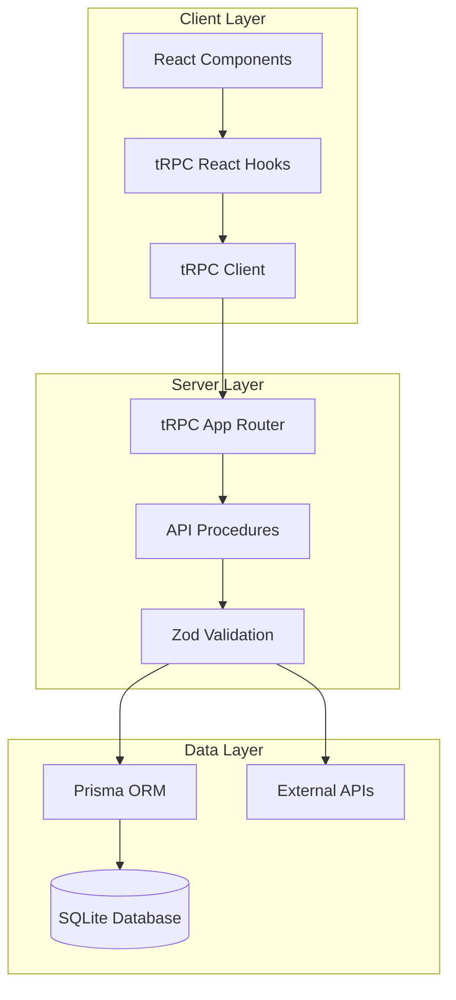

# tRPC API Reference

## Overview

The Investment Tracker uses tRPC (TypeScript Remote Procedure Call) to provide end-to-end type safety between the client and server. All API endpoints are defined as procedures with input validation using Zod schemas, ensuring data integrity and excellent developer experience.

## API Architecture



## API Structure

The tRPC router is organized into logical groups of related operations:

```typescript
export const appRouter = router({
  // Stock operations
  getStocks: publicProcedure.query(/* ... */),
  getStock: publicProcedure.input(/* ... */).query(/* ... */),
  searchStocks: publicProcedure.input(/* ... */).query(/* ... */),
  
  // Watchlist operations  
  getWatchlist: publicProcedure.query(/* ... */),
  addToWatchlist: publicProcedure.input(/* ... */).mutation(/* ... */),
  updateWatchlistItem: publicProcedure.input(/* ... */).mutation(/* ... */),
  removeFromWatchlist: publicProcedure.input(/* ... */).mutation(/* ... */),
  
  // Data refresh operations
  refreshStockQuote: publicProcedure.input(/* ... */).mutation(/* ... */),
  refreshAllWatchlistPrices: publicProcedure.mutation(/* ... */),
  refreshAllFinancialData: publicProcedure.mutation(/* ... */),
  enrichAllStockData: publicProcedure.mutation(/* ... */),
})

export type AppRouter = typeof appRouter
```

## Stock Operations

### getStocks
Retrieve all stocks in the database with optional filtering.

```typescript
getStocks: publicProcedure.query(async () => {
  return await db.stock.findMany({
    orderBy: { ticker: 'asc' },
    include: {
      watchlistItems: true,
      financialData: {
        where: { period: 'annual' },
        orderBy: { updatedAt: 'desc' },
        take: 1
      }
    }
  })
})
```

**Response Type:**
```typescript
type Stock = {
  id: string
  ticker: string
  name: string
  currency: string
  sector: string | null
  industry: string | null
  exchange: string | null
  marketCap: number | null
  price: number | null
  createdAt: Date
  updatedAt: Date
  watchlistItems: WatchlistItem[]
  financialData: FinancialData[]
}
```

**Usage:**
```typescript
// React component usage
const { data: stocks, isLoading } = trpc.getStocks.useQuery()

// Handle loading state
if (isLoading) return <div>Loading stocks...</div>

// Render stocks
return (
  <div>
    {stocks?.map(stock => (
      <div key={stock.id}>{stock.ticker} - {stock.name}</div>
    ))}
  </div>
)
```

### getStock
Retrieve a single stock by ticker with full financial data.

```typescript
getStock: publicProcedure
  .input(z.object({
    ticker: z.string().min(1).max(10)
  }))
  .query(async ({ input }) => {
    return await db.stock.findUnique({
      where: { ticker: input.ticker },
      include: {
        watchlistItems: true,
        financialData: {
          orderBy: { updatedAt: 'desc' }
        }
      }
    })
  })
```

**Input Schema:**
```typescript
{
  ticker: string // 1-10 characters, e.g., "AAPL"
}
```

**Usage:**
```typescript
const { data: stock } = trpc.getStock.useQuery({ ticker: 'AAPL' })

if (stock) {
  console.log(`${stock.name} - $${stock.price}`)
}
```

### searchStocks
Search for stocks using external API with symbol lookup.

```typescript
searchStocks: publicProcedure
  .input(z.object({
    query: z.string().min(1).max(50)
  }))
  .query(async ({ input }) => {
    try {
      const results = await fmpFinancialApi.searchSymbols(input.query)
      return results
    } catch (error) {
      console.error('Search error:', error)
      return []
    }
  })
```

**Input Schema:**
```typescript
{
  query: string // Search term, 1-50 characters
}
```

**Response Type:**
```typescript
type SearchResult = {
  ticker: string
  name: string
  type?: string
  region?: string
  currency?: string
}[]
```

**Usage:**
```typescript
const [searchQuery, setSearchQuery] = useState('')
const { data: searchResults } = trpc.searchStocks.useQuery(
  { query: searchQuery },
  { enabled: searchQuery.length > 2 } // Only search when query is long enough
)
```

## Watchlist Operations

### getWatchlist
Retrieve user's complete watchlist with stock details and financial data.

```typescript
getWatchlist: publicProcedure.query(async () => {
  return await db.watchlistItem.findMany({
    include: {
      stock: {
        include: {
          financialData: {
            where: { period: 'annual' },
            orderBy: { updatedAt: 'desc' },
            take: 1
          },
        },
      },
    },
    orderBy: { createdAt: 'desc' },
  })
})
```

**Response Type:**
```typescript
type WatchlistItem = {
  id: string
  stockId: string
  status: string // 'WATCHING' | 'OWNED' | 'SOLD'
  quantity: number | null
  avgPrice: number | null
  notes: string | null
  createdAt: Date
  updatedAt: Date
  stock: Stock & {
    financialData: FinancialData[]
  }
}[]
```

**Usage:**
```typescript
const { data: watchlist, refetch } = trpc.getWatchlist.useQuery()

// Calculate portfolio value
const portfolioValue = watchlist?.reduce((total, item) => {
  if (item.status === 'OWNED' && item.quantity && item.stock.price) {
    return total + (item.quantity * item.stock.price)
  }
  return total
}, 0) ?? 0
```

### addToWatchlist
Add a stock to the user's watchlist, creating the stock record if needed.

```typescript
addToWatchlist: publicProcedure
  .input(z.object({
    ticker: z.string().min(1).max(10),
    status: z.enum(['WATCHING', 'OWNED', 'SOLD']).default('WATCHING'),
    quantity: z.number().positive().optional(),
    avgPrice: z.number().positive().optional(),
    notes: z.string().max(500).optional(),
  }))
  .mutation(async ({ input }) => {
    // First, ensure the stock exists
    let stock = await db.stock.findUnique({
      where: { ticker: input.ticker }
    })

    if (!stock) {
      // Create stock if it doesn't exist
      const profile = await fmpFinancialApi.getCompanyProfile(input.ticker)
      if (!profile) {
        throw new Error(`Could not find stock with ticker: ${input.ticker}`)
      }

      stock = await db.stock.create({
        data: {
          ticker: profile.symbol,
          name: profile.name,
          currency: profile.currency,
          sector: profile.sector,
          industry: profile.industry,
          exchange: profile.exchange,
          marketCap: profile.marketCap,
          price: profile.price,
        }
      })
    }

    // Check if already in watchlist
    const existing = await db.watchlistItem.findFirst({
      where: { stockId: stock.id }
    })

    if (existing) {
      throw new Error(`${input.ticker} is already in your watchlist`)
    }

    // Add to watchlist
    return await db.watchlistItem.create({
      data: {
        stockId: stock.id,
        status: input.status,
        quantity: input.quantity,
        avgPrice: input.avgPrice,
        notes: input.notes,
      },
      include: {
        stock: true
      }
    })
  })
```

**Input Schema:**
```typescript
{
  ticker: string        // 1-10 characters, required
  status?: 'WATCHING' | 'OWNED' | 'SOLD' // defaults to 'WATCHING'
  quantity?: number     // positive number, optional
  avgPrice?: number     // positive number, optional
  notes?: string        // max 500 characters, optional
}
```

**Usage:**
```typescript
const addToWatchlist = trpc.addToWatchlist.useMutation({
  onSuccess: () => {
    // Refetch watchlist after successful addition
    trpc.getWatchlist.invalidate()
    toast.success('Stock added to watchlist')
  },
  onError: (error) => {
    toast.error(error.message)
  }
})

// Add a stock
const handleAddStock = () => {
  addToWatchlist.mutate({
    ticker: 'AAPL',
    status: 'OWNED',
    quantity: 100,
    avgPrice: 150.25,
    notes: 'Core holding'
  })
}
```

### updateWatchlistItem
Update an existing watchlist item's details.

```typescript
updateWatchlistItem: publicProcedure
  .input(z.object({
    id: z.string(),
    status: z.enum(['WATCHING', 'OWNED', 'SOLD']).optional(),
    quantity: z.number().positive().nullable().optional(),
    avgPrice: z.number().positive().nullable().optional(),
    notes: z.string().max(500).nullable().optional(),
  }))
  .mutation(async ({ input }) => {
    const { id, ...updateData } = input
    
    return await db.watchlistItem.update({
      where: { id },
      data: updateData,
      include: {
        stock: true
      }
    })
  })
```

**Input Schema:**
```typescript
{
  id: string                    // Required watchlist item ID
  status?: 'WATCHING' | 'OWNED' | 'SOLD'
  quantity?: number | null      // Can be set to null
  avgPrice?: number | null      // Can be set to null  
  notes?: string | null         // Can be set to null
}
```

**Usage:**
```typescript
const updateItem = trpc.updateWatchlistItem.useMutation({
  onSuccess: () => {
    trpc.getWatchlist.invalidate()
    toast.success('Position updated')
  }
})

// Update position
updateItem.mutate({
  id: 'watchlist_item_id',
  status: 'SOLD',
  quantity: null,
  avgPrice: null,
  notes: 'Sold for profit'
})
```

### removeFromWatchlist
Remove a stock from the watchlist.

```typescript
removeFromWatchlist: publicProcedure
  .input(z.object({
    id: z.string()
  }))
  .mutation(async ({ input }) => {
    return await db.watchlistItem.delete({
      where: { id: input.id }
    })
  })
```

**Usage:**
```typescript
const removeItem = trpc.removeFromWatchlist.useMutation({
  onSuccess: () => {
    trpc.getWatchlist.invalidate()
    toast.success('Stock removed from watchlist')
  }
})

removeItem.mutate({ id: 'watchlist_item_id' })
```

## Data Refresh Operations

### refreshStockQuote
Refresh price data for a single stock from external API.

```typescript
refreshStockQuote: publicProcedure
  .input(z.object({
    ticker: z.string().min(1).max(10)
  }))
  .mutation(async ({ input }) => {
    const stock = await db.stock.findUnique({
      where: { ticker: input.ticker }
    })

    if (!stock) {
      throw new Error(`Stock ${input.ticker} not found`)
    }

    const quote = await fmpFinancialApi.getStockQuote(input.ticker)
    if (!quote) {
      throw new Error(`Failed to fetch quote for ${input.ticker}`)
    }

    return await db.stock.update({
      where: { id: stock.id },
      data: {
        price: quote.price,
        marketCap: quote.marketCap,
        updatedAt: new Date(),
      },
    })
  })
```

**Usage:**
```typescript
const refreshQuote = trpc.refreshStockQuote.useMutation({
  onSuccess: (updatedStock) => {
    trpc.getWatchlist.invalidate()
    toast.success(`Updated ${updatedStock.ticker} price`)
  }
})

refreshQuote.mutate({ ticker: 'AAPL' })
```

### refreshAllWatchlistPrices
Smart refresh of all watchlist stock prices using cache logic.

```typescript
refreshAllWatchlistPrices: publicProcedure
  .input(z.object({
    forceRefresh: z.boolean().default(false)
  }).optional().default({}))
  .mutation(async ({ input = {} }) => {
    const { forceRefresh = false } = input

    const watchlistStocks = await db.stock.findMany({
      where: {
        watchlistItems: {
          some: {
            status: { in: ['WATCHING', 'OWNED'] }
          }
        }
      },
      select: {
        id: true,
        ticker: true,
        price: true,
        marketCap: true,
        updatedAt: true
      }
    })

    // Apply smart caching unless force refresh
    const stocksNeedingUpdate = forceRefresh 
      ? watchlistStocks 
      : watchlistStocks.filter(stock => shouldRefreshPriceData(stock.updatedAt))

    if (stocksNeedingUpdate.length === 0 && !forceRefresh) {
      return {
        updated: [],
        skipped: watchlistStocks.length,
        totalStocks: watchlistStocks.length,
        message: 'All price data is already fresh (updated within 2 hours)'
      }
    }

    const results = []
    for (const stock of stocksNeedingUpdate) {
      try {
        const quote = await fmpFinancialApi.getStockQuote(stock.ticker)
        if (quote) {
          const updated = await db.stock.update({
            where: { id: stock.id },
            data: {
              price: quote.price,
              marketCap: quote.marketCap,
              updatedAt: new Date(),
            },
          })
          results.push(updated)
        }
      } catch (error) {
        console.error(`Error updating ${stock.ticker}:`, error)
      }
    }

    return {
      updated: results,
      skipped: watchlistStocks.length - stocksNeedingUpdate.length,
      totalStocks: watchlistStocks.length,
      message: forceRefresh 
        ? `Force refreshed ${results.length} stocks`
        : `Smart refresh: Updated ${results.length} stale stocks`
    }
  })
```

**Response Type:**
```typescript
{
  updated: Stock[]     // Array of updated stock records
  skipped: number     // Number of stocks skipped (fresh data)
  totalStocks: number // Total stocks in watchlist
  message: string     // Human-readable summary
}
```

**Usage:**
```typescript
const refreshPrices = trpc.refreshAllWatchlistPrices.useMutation({
  onSuccess: (result) => {
    trpc.getWatchlist.invalidate()
    toast.success(result.message)
  }
})

// Smart refresh (respects cache)
refreshPrices.mutate()

// Force refresh (ignores cache)
refreshPrices.mutate({ forceRefresh: true })
```

### refreshAllFinancialData
Smart refresh of financial statement data with 12-hour cache.

```typescript
refreshAllFinancialData: publicProcedure
  .input(z.object({
    forceRefresh: z.boolean().default(false)
  }).optional().default({}))
  .mutation(async ({ input = {} }) => {
    const { forceRefresh = false } = input

    const watchlistStocks = await db.stock.findMany({
      where: {
        watchlistItems: {
          some: {
            status: { in: ['WATCHING', 'OWNED'] }
          }
        }
      },
      include: {
        financialData: {
          where: { period: 'annual' },
          orderBy: { updatedAt: 'desc' },
          take: 1
        }
      }
    })

    // Apply smart caching for financial data
    const stocksNeedingUpdate = forceRefresh 
      ? watchlistStocks 
      : watchlistStocks.filter(stock => {
          const latestFinancialData = stock.financialData[0]
          return shouldRefreshFinancialData(latestFinancialData?.updatedAt)
        })

    if (stocksNeedingUpdate.length === 0 && !forceRefresh) {
      return {
        updated: [],
        skipped: watchlistStocks.length,
        totalStocks: watchlistStocks.length,
        message: 'All financial data is already fresh (updated within 12 hours)'
      }
    }

    const results = []
    for (const stock of stocksNeedingUpdate) {
      try {
        const financialData = await fmpFinancialApi.getFinancialData(stock.ticker)
        if (financialData) {
          // Upsert financial data
          const created = await db.financialData.upsert({
            where: {
              stockId_period: {
                stockId: stock.id,
                period: 'annual'
              }
            },
            update: {
              revenue: financialData.revenue,
              revenueGrowth: financialData.revenueGrowth,
              // ... other fields
              updatedAt: new Date()
            },
            create: {
              stockId: stock.id,
              period: 'annual',
              // ... financial data fields
              dataDate: new Date(financialData.date),
              createdAt: new Date(),
              updatedAt: new Date()
            }
          })
          results.push({ stock: stock.ticker, financial: created })
        }
      } catch (error) {
        console.error(`Error fetching financial data for ${stock.ticker}:`, error)
      }
    }

    return {
      updated: results,
      skipped: watchlistStocks.length - stocksNeedingUpdate.length,
      totalStocks: watchlistStocks.length,
      message: forceRefresh 
        ? `Force refreshed ${results.length} stocks`
        : `Smart refresh: Updated ${results.length} stale stocks`
    }
  })
```

### enrichAllStockData
Enrich stocks with missing company profile data (sector, industry, exchange).

```typescript
enrichAllStockData: publicProcedure
  .mutation(async () => {
    // Find stocks with incomplete or stale data
    const stocks = await db.stock.findMany({
      where: {
        OR: [
          { sector: null },
          { exchange: null },
          { industry: null },
          { marketCap: null },
          {
            updatedAt: {
              lt: new Date(Date.now() - 24 * 60 * 60 * 1000) // 24 hours ago
            }
          }
        ]
      }
    })

    const stocksNeedingEnrichment = stocks.filter(stock => {
      const hasIncompleteData = !stock.sector || !stock.exchange || !stock.industry || !stock.marketCap
      const isStale = shouldRefreshPriceData(stock.updatedAt)
      
      return hasIncompleteData || isStale
    })

    if (stocksNeedingEnrichment.length === 0) {
      return {
        updated: [],
        skipped: stocks.length,
        totalStocks: stocks.length,
        message: 'All stock data is already complete and fresh'
      }
    }

    const results = []
    for (const stock of stocksNeedingEnrichment) {
      try {
        const profile = await fmpFinancialApi.getCompanyProfile(stock.ticker)
        
        if (profile) {
          const updated = await db.stock.update({
            where: { id: stock.id },
            data: {
              name: profile.name,
              sector: profile.sector,
              industry: profile.industry,
              exchange: profile.exchange,
              marketCap: profile.marketCap,
              updatedAt: new Date(),
            },
          })
          results.push(updated)
        }
      } catch (error) {
        console.error(`Error enriching data for ${stock.ticker}:`, error)
      }
    }

    return {
      updated: results,
      skipped: stocks.length - stocksNeedingEnrichment.length,
      totalStocks: stocks.length,
      message: `Smart enrichment: Updated ${results.length} stocks`
    }
  })
```

## Client Usage Patterns

### React Query Integration

tRPC integrates seamlessly with TanStack Query for optimal caching:

```typescript
// Query with automatic caching
const { data, isLoading, error } = trpc.getWatchlist.useQuery()

// Query with custom options
const { data: stocks } = trpc.getStocks.useQuery(undefined, {
  staleTime: 5 * 60 * 1000, // 5 minutes
  refetchInterval: 30000,   // Refetch every 30 seconds
})

// Mutation with optimistic updates
const updateItem = trpc.updateWatchlistItem.useMutation({
  onMutate: async (newData) => {
    // Cancel outgoing refetches
    await utils.getWatchlist.cancel()
    
    // Snapshot previous value
    const previousData = utils.getWatchlist.getData()
    
    // Optimistically update cache
    utils.getWatchlist.setData(undefined, (old) => 
      old?.map(item => 
        item.id === newData.id ? { ...item, ...newData } : item
      )
    )
    
    return { previousData }
  },
  onError: (err, newData, context) => {
    // Rollback on error
    utils.getWatchlist.setData(undefined, context?.previousData)
  },
  onSettled: () => {
    // Refetch to ensure consistency
    utils.getWatchlist.invalidate()
  }
})
```

### Error Handling

```typescript
const { data, error, isError } = trpc.getStock.useQuery(
  { ticker: 'INVALID' },
  {
    retry: (failureCount, error) => {
      // Don't retry on validation errors
      if (error.data?.code === 'BAD_REQUEST') {
        return false
      }
      return failureCount < 3
    },
    onError: (error) => {
      if (error.data?.code === 'NOT_FOUND') {
        toast.error('Stock not found')
      } else {
        toast.error('Failed to load stock data')
      }
    }
  }
)
```

### Batch Operations

```typescript
// Refresh multiple data types concurrently
const refreshAllData = async () => {
  const [prices, financial, enrichment] = await Promise.allSettled([
    refreshPrices.mutateAsync(),
    refreshFinancial.mutateAsync(),
    enrichData.mutateAsync()
  ])
  
  const successCount = [prices, financial, enrichment]
    .filter(result => result.status === 'fulfilled').length
    
  toast.success(`Completed ${successCount}/3 refresh operations`)
}
```

## Type Safety Benefits

### Automatic Type Inference

```typescript
// TypeScript automatically infers return types
const { data } = trpc.getWatchlist.useQuery()
// data is typed as WatchlistItem[] | undefined

// Input validation at compile time
trpc.addToWatchlist.useMutation({
  onSuccess: (newItem) => {
    // newItem is fully typed based on procedure return type
    console.log(`Added ${newItem.stock.ticker}`)
  }
})
```

### IDE Integration

- **Autocomplete**: Full IntelliSense for all procedures and types
- **Error Detection**: Compile-time validation of API calls
- **Refactoring**: Safe renaming across client and server
- **Documentation**: Inline documentation for all procedures

### Runtime Validation

```typescript
// Zod schemas provide runtime validation
const addStock = trpc.addToWatchlist.useMutation({
  onError: (error) => {
    if (error.data?.code === 'BAD_REQUEST') {
      // Handle validation errors
      console.log('Validation errors:', error.data.zodError)
    }
  }
})

// This will fail validation
addStock.mutate({
  ticker: '', // Too short
  quantity: -1, // Must be positive
  notes: 'A'.repeat(600) // Too long
})
```

## Performance Considerations

### Query Optimization

```typescript
// Use select to fetch only needed fields
const { data: tickers } = trpc.getStocks.useQuery(undefined, {
  select: (stocks) => stocks.map(stock => stock.ticker)
})

// Prefetch data for better UX
const utils = trpc.useContext()
const prefetchStock = (ticker: string) => {
  utils.getStock.prefetch({ ticker })
}
```

### Infinite Queries

```typescript
// For large datasets, use infinite queries
const {
  data,
  fetchNextPage,
  hasNextPage,
  isFetchingNextPage,
} = trpc.getStocksPaginated.useInfiniteQuery(
  { limit: 20 },
  {
    getNextPageParam: (lastPage) => lastPage.nextCursor,
  }
)
```

### Background Updates

```typescript
// Keep data fresh with background refetching
const { data } = trpc.getWatchlist.useQuery(undefined, {
  refetchInterval: 60000, // Refetch every minute
  refetchIntervalInBackground: true,
  staleTime: 30000, // Data is fresh for 30 seconds
})
```