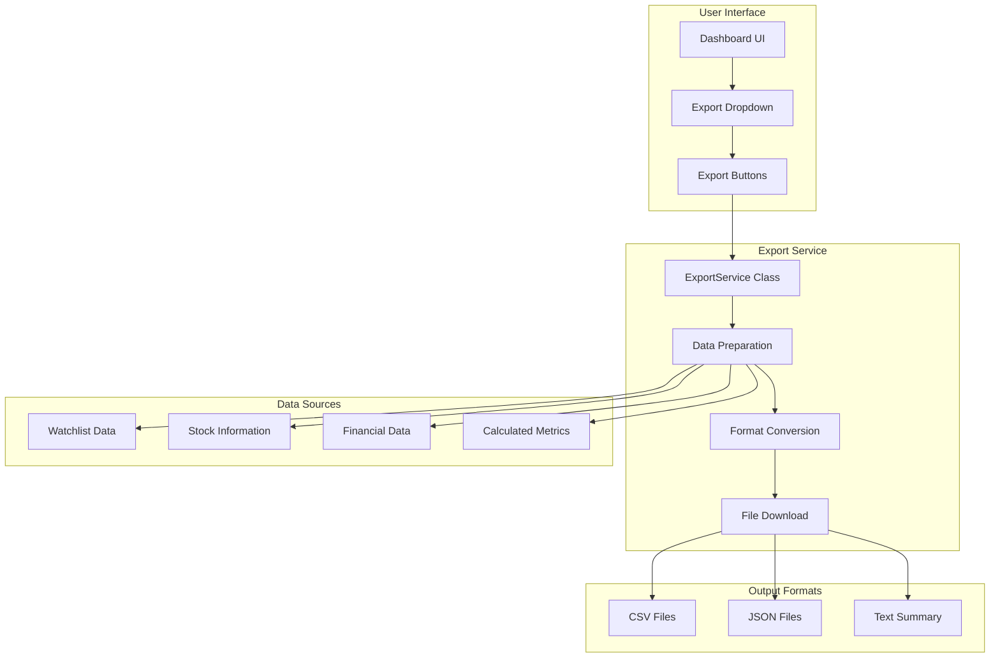

# Export System Documentation

## Overview

The Investment Tracker features a comprehensive export system that allows users to export their portfolio data in multiple formats for analysis, reporting, and record-keeping. The system supports CSV, JSON, and formatted summary exports with automatic calculations for gains/losses and portfolio analytics.

## Export Architecture



## ExportService Class

The core export functionality is provided by the `ExportService` class, which handles data preparation, format conversion, and file download operations.

### Class Structure

```typescript
export class ExportService {
  // Static methods for different export formats
  static exportToCSV(data: ExportData[], filename?: string): void
  static exportToJSON(data: ExportData[], filename?: string): void
  static exportPortfolioSummary(data: ExportData[], filename?: string): void
  
  // Utility methods
  static prepareExportData(watchlistData: WatchlistWithStock[]): ExportData[]
  private static downloadFile(content: string, filename: string, mimeType: string): void
}
```

## Data Preparation

### Input Data Structure

The export system takes watchlist data with associated stock information:

```typescript
type WatchlistWithStock = {
  id: string
  status: string                    // 'WATCHING' | 'OWNED' | 'SOLD'
  quantity?: number | null
  avgPrice?: number | null
  notes?: string | null
  stock: {
    ticker: string
    name: string
    price?: number | null
    currency: string
    sector?: string | null
  }
}[]
```

### Export Data Transformation

The `prepareExportData` method transforms watchlist data into a standardized export format:

```typescript
static prepareExportData(watchlistData: WatchlistWithStock[]): ExportData[] {
  return watchlistData.map(item => {
    // Calculate market value for owned positions
    const marketValue = item.quantity && item.stock.price ? 
      item.quantity * item.stock.price : undefined
    
    // Calculate gain/loss for owned positions
    const gainLoss = item.quantity && item.avgPrice && item.stock.price ?
      (item.quantity * item.stock.price) - (item.quantity * item.avgPrice) : undefined
    
    // Calculate percentage gain/loss
    const gainLossPercent = gainLoss && item.quantity && item.avgPrice ?
      (gainLoss / (item.quantity * item.avgPrice)) * 100 : undefined

    return {
      ticker: item.stock.ticker,
      name: item.stock.name,
      status: item.status,
      quantity: item.quantity,
      avgPrice: item.avgPrice,
      currentPrice: item.stock.price,
      marketValue,
      gainLoss,
      gainLossPercent,
      sector: item.stock.sector,
      currency: item.stock.currency,
      notes: item.notes,
    }
  })
}
```

### Calculated Metrics

The export system automatically calculates key investment metrics:

#### Market Value Calculation
```typescript
// Market value = quantity × current price
const marketValue = item.quantity && item.stock.price ? 
  item.quantity * item.stock.price : undefined
```

#### Gain/Loss Calculation
```typescript
// Absolute gain/loss = (quantity × current price) - (quantity × average price)
const gainLoss = item.quantity && item.avgPrice && item.stock.price ?
  (item.quantity * item.stock.price) - (item.quantity * item.avgPrice) : undefined
```

#### Percentage Return Calculation
```typescript
// Percentage return = gain/loss ÷ original investment × 100
const gainLossPercent = gainLoss && item.quantity && item.avgPrice ?
  (gainLoss / (item.quantity * item.avgPrice)) * 100 : undefined
```

## Export Formats

### CSV Export

CSV format is ideal for spreadsheet analysis and financial software integration.

```typescript
static exportToCSV(data: ExportData[], filename: string = 'portfolio-export.csv') {
  const headers = [
    'Ticker', 'Company Name', 'Status', 'Quantity', 'Avg Price',
    'Current Price', 'Market Value', 'Gain/Loss ($)', 'Gain/Loss (%)',
    'Sector', 'Currency', 'Notes'
  ]

  const csvContent = [
    headers.join(','),
    ...data.map(row => [
      row.ticker,
      `"${row.name.replace(/"/g, '""')}"`,  // Escape quotes in company names
      row.status,
      row.quantity || '',
      row.avgPrice || '',
      row.currentPrice || '',
      row.marketValue || '',
      row.gainLoss || '',
      row.gainLossPercent ? `${row.gainLossPercent.toFixed(2)}%` : '',
      row.sector || '',
      row.currency,
      row.notes ? `"${row.notes.replace(/"/g, '""')}"` : ''
    ].join(','))
  ].join('\n')

  this.downloadFile(csvContent, filename, 'text/csv')
}
```

#### CSV Output Example
```csv
Ticker,Company Name,Status,Quantity,Avg Price,Current Price,Market Value,Gain/Loss ($),Gain/Loss (%),Sector,Currency,Notes
AAPL,"Apple Inc.",OWNED,100,150.25,175.50,17550,2525.00,16.81%,Technology,USD,"Core holding"
MSFT,"Microsoft Corporation",OWNED,50,280.00,350.00,17500,3500.00,25.00%,Technology,USD,""
TSLA,"Tesla, Inc.",WATCHING,,,250.00,,,,,Technology,USD,"Potential buy"
```

#### CSV Features
- **Proper Escaping**: Handles quotes and commas in text fields
- **Percentage Formatting**: Displays percentages with % symbol
- **Empty Value Handling**: Gracefully handles null/undefined values
- **UTF-8 Encoding**: Supports international characters

### JSON Export

JSON format provides structured data for programmatic analysis and integration.

```typescript
static exportToJSON(data: ExportData[], filename: string = 'portfolio-export.json') {
  const jsonContent = JSON.stringify(data, null, 2)  // Pretty-printed with 2-space indent
  this.downloadFile(jsonContent, filename, 'application/json')
}
```

#### JSON Output Example
```json
[
  {
    "ticker": "AAPL",
    "name": "Apple Inc.",
    "status": "OWNED",
    "quantity": 100,
    "avgPrice": 150.25,
    "currentPrice": 175.50,
    "marketValue": 17550,
    "gainLoss": 2525,
    "gainLossPercent": 16.81,
    "sector": "Technology",
    "currency": "USD",
    "notes": "Core holding"
  },
  {
    "ticker": "MSFT",
    "name": "Microsoft Corporation",
    "status": "OWNED",
    "quantity": 50,
    "avgPrice": 280.00,
    "currentPrice": 350.00,
    "marketValue": 17500,
    "gainLoss": 3500,
    "gainLossPercent": 25.00,
    "sector": "Technology",
    "currency": "USD",
    "notes": null
  }
]
```

#### JSON Features
- **Type Preservation**: Maintains numeric types and null values
- **Pretty Printing**: Human-readable formatting with indentation
- **Complete Data**: All available fields included
- **Programmatic Friendly**: Easy to parse and process

### Portfolio Summary Export

The summary format provides a comprehensive human-readable report suitable for presentations and record-keeping.

```typescript
static exportPortfolioSummary(data: ExportData[], filename: string = 'portfolio-summary.txt') {
  const ownedStocks = data.filter(item => item.status === 'OWNED')
  
  // Calculate portfolio-level metrics
  const totalValue = ownedStocks.reduce((sum, item) => sum + (item.marketValue || 0), 0)
  const totalGainLoss = ownedStocks.reduce((sum, item) => sum + (item.gainLoss || 0), 0)
  const totalGainLossPercent = totalValue > 0 ? (totalGainLoss / (totalValue - totalGainLoss)) * 100 : 0

  // Calculate sector allocation
  const sectorBreakdown = ownedStocks.reduce((acc, item) => {
    const sector = item.sector || 'Unknown'
    if (!acc[sector]) acc[sector] = { value: 0, count: 0 }
    acc[sector].value += item.marketValue || 0
    acc[sector].count += 1
    return acc
  }, {} as Record<string, { value: number; count: number }>)

  // Generate formatted summary
  const summary = `
INVESTMENT PORTFOLIO SUMMARY
Generated on: ${new Date().toLocaleDateString()}

PORTFOLIO OVERVIEW
=================
Total Portfolio Value: $${totalValue.toLocaleString()}
Total Gain/Loss: ${totalGainLoss >= 0 ? '+' : ''}$${totalGainLoss.toLocaleString()}
Total Return: ${totalGainLossPercent >= 0 ? '+' : ''}${totalGainLossPercent.toFixed(2)}%
Number of Positions: ${ownedStocks.length}
Number of Watching: ${data.filter(item => item.status === 'WATCHING').length}

SECTOR ALLOCATION
================
${Object.entries(sectorBreakdown)
  .sort((a, b) => b[1].value - a[1].value)
  .map(([sector, info]) => 
    `${sector}: $${info.value.toLocaleString()} (${((info.value / totalValue) * 100).toFixed(1)}%) - ${info.count} positions`
  ).join('\n')}

TOP POSITIONS BY VALUE
=====================
${ownedStocks
  .sort((a, b) => (b.marketValue || 0) - (a.marketValue || 0))
  .slice(0, 10)
  .map((item, index) => 
    `${index + 1}. ${item.ticker} - $${(item.marketValue || 0).toLocaleString()} (${item.gainLoss ? (item.gainLoss >= 0 ? '+' : '') + '$' + item.gainLoss.toLocaleString() : 'N/A'})`
  ).join('\n')}

DETAILED HOLDINGS
================
${ownedStocks.map(item => `
${item.ticker} - ${item.name}
  Quantity: ${item.quantity || 'N/A'}
  Avg Price: $${item.avgPrice || 'N/A'}
  Current Price: $${item.currentPrice || 'N/A'}
  Market Value: $${(item.marketValue || 0).toLocaleString()}
  Gain/Loss: ${item.gainLoss ? (item.gainLoss >= 0 ? '+' : '') + '$' + item.gainLoss.toLocaleString() : 'N/A'}
  Sector: ${item.sector || 'Unknown'}
  ${item.notes ? 'Notes: ' + item.notes : ''}
`).join('\n')}

WATCHLIST
=========
${data.filter(item => item.status === 'WATCHING').map(item => `
${item.ticker} - ${item.name}
  Current Price: $${item.currentPrice || 'N/A'}
  Sector: ${item.sector || 'Unknown'}
  ${item.notes ? 'Notes: ' + item.notes : ''}
`).join('\n')}
`.trim()

  this.downloadFile(summary, filename, 'text/plain')
}
```

#### Summary Report Sections

##### Portfolio Overview
- Total portfolio value
- Absolute and percentage gains/losses
- Position counts by status

##### Sector Allocation
- Value and percentage allocation by sector
- Number of positions per sector
- Sorted by allocation size

##### Top Positions
- Top 10 positions by market value
- Individual position gains/losses
- Ranked list format

##### Detailed Holdings
- Complete information for each owned position
- Formatted for easy reading
- Includes notes and sector information

##### Watchlist
- All stocks being watched
- Current prices and sectors
- Notes for potential purchases

#### Summary Output Example
```
INVESTMENT PORTFOLIO SUMMARY
Generated on: 1/15/2024

PORTFOLIO OVERVIEW
=================
Total Portfolio Value: $125,750
Total Gain/Loss: +$18,325
Total Return: +17.06%
Number of Positions: 5
Number of Watching: 3

SECTOR ALLOCATION
================
Technology: $75,250 (59.8%) - 3 positions
Healthcare: $32,500 (25.8%) - 1 position
Finance: $18,000 (14.3%) - 1 position

TOP POSITIONS BY VALUE
=====================
1. AAPL - $35,000 (+$5,250)
2. MSFT - $25,750 (+$3,750)
3. JNJ - $32,500 (+$2,500)
4. JPM - $18,000 (+$1,800)
5. GOOGL - $14,500 (+$1,250)
```

## File Download Implementation

### Browser Download Mechanism

The export system uses the HTML5 download API for client-side file generation:

```typescript
private static downloadFile(content: string, filename: string, mimeType: string) {
  // Create blob with proper MIME type
  const blob = new Blob([content], { type: mimeType })
  const url = URL.createObjectURL(blob)
  
  // Create temporary download link
  const link = document.createElement('a')
  link.href = url
  link.download = filename
  
  // Trigger download
  document.body.appendChild(link)
  link.click()
  
  // Cleanup
  document.body.removeChild(link)
  URL.revokeObjectURL(url)
}
```

#### Download Features
- **Client-Side Generation**: No server round-trip required
- **Memory Efficient**: Blob URLs for large files
- **Cross-Browser Compatible**: Works in all modern browsers
- **Automatic Cleanup**: Prevents memory leaks

## UI Integration

### Dashboard Export Controls

The export functionality is integrated into the dashboard with a dropdown menu:

```typescript
// Dashboard component export section
<DropdownMenu>
  <DropdownMenuTrigger asChild>
    <Button variant="outline" className="flex items-center gap-2">
      <Download className="h-4 w-4" />
      Export
    </Button>
  </DropdownMenuTrigger>
  <DropdownMenuContent align="end" className="w-56">
    <DropdownMenuItem onClick={handleExportCSV}>
      <FileSpreadsheet className="mr-2 h-4 w-4" />
      Export as CSV
    </DropdownMenuItem>
    <DropdownMenuItem onClick={handleExportJSON}>
      <FileText className="mr-2 h-4 w-4" />
      Export as JSON
    </DropdownMenuItem>
    <DropdownMenuItem onClick={handleExportSummary}>
      <FileBarChart className="mr-2 h-4 w-4" />
      Portfolio Summary
    </DropdownMenuItem>
  </DropdownMenuContent>
</DropdownMenu>
```

### Export Handler Functions

```typescript
const handleExportCSV = async () => {
  try {
    const watchlistData = await trpc.getWatchlist.refetch()
    if (watchlistData.data) {
      const exportData = exportService.prepareExportData(watchlistData.data)
      exportService.exportToCSV(exportData)
      toast.success('CSV export downloaded successfully')
    }
  } catch (error) {
    toast.error('Failed to export CSV')
  }
}

const handleExportJSON = async () => {
  try {
    const watchlistData = await trpc.getWatchlist.refetch()
    if (watchlistData.data) {
      const exportData = exportService.prepareExportData(watchlistData.data)
      exportService.exportToJSON(exportData)
      toast.success('JSON export downloaded successfully')
    }
  } catch (error) {
    toast.error('Failed to export JSON')
  }
}

const handleExportSummary = async () => {
  try {
    const watchlistData = await trpc.getWatchlist.refetch()
    if (watchlistData.data) {
      const exportData = exportService.prepareExportData(watchlistData.data)
      exportService.exportPortfolioSummary(exportData)
      toast.success('Portfolio summary downloaded successfully')
    }
  } catch (error) {
    toast.error('Failed to export summary')
  }
}
```

## Use Cases and Applications

### Portfolio Analysis
- **Spreadsheet Import**: CSV format for Excel/Google Sheets analysis
- **Performance Tracking**: Historical export for trend analysis
- **Tax Reporting**: Gain/loss calculations for tax preparation

### Data Backup
- **Complete Backup**: JSON format preserves all data relationships
- **Human-Readable Backup**: Summary format for offline records
- **Version Control**: Track portfolio changes over time

### Reporting and Presentations
- **Executive Summary**: Portfolio summary for stakeholder meetings
- **Investment Committee**: Detailed holdings for investment reviews
- **Personal Records**: Complete portfolio documentation

### Integration with External Tools
- **Financial Software**: CSV import into accounting systems
- **Portfolio Analyzers**: JSON data for third-party analysis tools
- **Risk Management**: Export for risk assessment applications

## Performance Considerations

### Large Portfolio Handling

```typescript
// Efficient data processing for large portfolios
static prepareExportDataOptimized(watchlistData: WatchlistWithStock[]): ExportData[] {
  return watchlistData.map(item => {
    // Pre-calculate common values
    const quantity = item.quantity || 0
    const avgPrice = item.avgPrice || 0
    const currentPrice = item.stock.price || 0
    
    // Batch calculations
    const originalValue = quantity * avgPrice
    const currentValue = quantity * currentPrice
    const gainLoss = currentValue - originalValue
    
    return {
      ticker: item.stock.ticker,
      name: item.stock.name,
      status: item.status,
      quantity: quantity || null,
      avgPrice: avgPrice || null,
      currentPrice: currentPrice || null,
      marketValue: currentValue || null,
      gainLoss: gainLoss || null,
      gainLossPercent: originalValue > 0 ? (gainLoss / originalValue) * 100 : null,
      sector: item.stock.sector,
      currency: item.stock.currency,
      notes: item.notes,
    }
  })
}
```

### Memory Management

```typescript
// Stream processing for very large datasets
static exportLargeDatasetToCSV(data: ExportData[], filename: string) {
  const headers = this.getCSVHeaders()
  let csvContent = headers.join(',') + '\n'
  
  // Process data in chunks to avoid memory issues
  const chunkSize = 1000
  for (let i = 0; i < data.length; i += chunkSize) {
    const chunk = data.slice(i, i + chunkSize)
    const chunkCsv = chunk.map(row => this.formatCSVRow(row)).join('\n')
    csvContent += chunkCsv + '\n'
  }
  
  this.downloadFile(csvContent, filename, 'text/csv')
}
```

## Error Handling and Validation

### Data Validation

```typescript
// Validate export data before processing
static validateExportData(data: ExportData[]): { isValid: boolean; errors: string[] } {
  const errors: string[] = []
  
  if (!Array.isArray(data)) {
    errors.push('Export data must be an array')
    return { isValid: false, errors }
  }
  
  data.forEach((item, index) => {
    if (!item.ticker) {
      errors.push(`Row ${index + 1}: Missing ticker symbol`)
    }
    
    if (item.quantity && item.quantity < 0) {
      errors.push(`Row ${index + 1}: Quantity cannot be negative`)
    }
    
    if (item.avgPrice && item.avgPrice < 0) {
      errors.push(`Row ${index + 1}: Average price cannot be negative`)
    }
  })
  
  return { isValid: errors.length === 0, errors }
}
```

### Export Error Recovery

```typescript
// Graceful error handling for export operations
const handleExportWithErrorRecovery = async (format: 'csv' | 'json' | 'summary') => {
  try {
    // Attempt to get fresh data
    const result = await trpc.getWatchlist.refetch()
    
    if (!result.data || result.data.length === 0) {
      toast.warning('No data available to export')
      return
    }
    
    const exportData = exportService.prepareExportData(result.data)
    
    // Validate data before export
    const validation = exportService.validateExportData(exportData)
    if (!validation.isValid) {
      console.error('Export validation errors:', validation.errors)
      toast.error('Export data validation failed')
      return
    }
    
    // Perform export based on format
    switch (format) {
      case 'csv':
        exportService.exportToCSV(exportData)
        break
      case 'json':
        exportService.exportToJSON(exportData)
        break
      case 'summary':
        exportService.exportPortfolioSummary(exportData)
        break
    }
    
    toast.success(`${format.toUpperCase()} export completed successfully`)
    
  } catch (error) {
    console.error('Export error:', error)
    toast.error(`Failed to export ${format.toUpperCase()}. Please try again.`)
  }
}
```

## Best Practices

### File Naming Conventions

```typescript
// Generate descriptive filenames with timestamps
static generateFilename(format: string, type: string = 'portfolio'): string {
  const timestamp = new Date().toISOString().split('T')[0] // YYYY-MM-DD
  const timeString = new Date().toTimeString().slice(0, 5).replace(':', '') // HHMM
  
  return `${type}-${timestamp}-${timeString}.${format}`
}

// Usage examples:
// portfolio-2024-01-15-1430.csv
// portfolio-2024-01-15-1430.json
// portfolio-summary-2024-01-15-1430.txt
```

### Data Privacy and Security

```typescript
// Sanitize sensitive data before export
static sanitizeExportData(data: ExportData[], includePII: boolean = true): ExportData[] {
  return data.map(item => ({
    ...item,
    // Optionally remove personal notes
    notes: includePII ? item.notes : null,
    // Round financial values for privacy
    avgPrice: item.avgPrice ? Math.round(item.avgPrice * 100) / 100 : null,
    currentPrice: item.currentPrice ? Math.round(item.currentPrice * 100) / 100 : null,
  }))
}
```

### Export Automation

```typescript
// Scheduled export functionality
export const schedulePortfolioExport = (frequency: 'daily' | 'weekly' | 'monthly') => {
  const exportPortfolio = async () => {
    try {
      const watchlistData = await trpc.getWatchlist.fetch()
      const exportData = exportService.prepareExportData(watchlistData)
      
      // Auto-generate timestamped filename
      const filename = exportService.generateFilename('csv', 'auto-export')
      exportService.exportToCSV(exportData, filename)
      
      console.log(`Automated export completed: ${filename}`)
    } catch (error) {
      console.error('Automated export failed:', error)
    }
  }
  
  // Set up recurring export based on frequency
  const intervals = {
    daily: 24 * 60 * 60 * 1000,
    weekly: 7 * 24 * 60 * 60 * 1000,
    monthly: 30 * 24 * 60 * 60 * 1000
  }
  
  return setInterval(exportPortfolio, intervals[frequency])
}
```