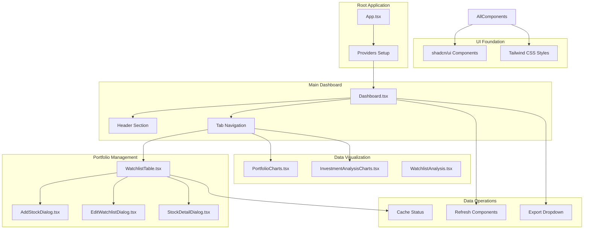

# UI Components Documentation

## Overview

The Investment Tracker features a modern, responsive React-based user interface built with TypeScript, Tailwind CSS, and shadcn/ui components. The interface provides comprehensive portfolio management, data visualization, and real-time financial analysis capabilities with a professional, gradient-rich design system.

## Component Architecture



## Design System

### Brand Identity
The Investment Tracker uses a premium, professional design aesthetic with the brand name "PORTFOLIO PRO" and tagline "Elite Investment Intelligence Platform".

### Color Palette
```css
/* Primary Gradients */
background: linear-gradient(135deg, #0f172a 0%, #1e293b 25%, #334155 50%, #475569 75%, #64748b 100%)

/* Accent Gradients */
emerald-gradient: linear-gradient(to right, #059669, #0d9488, #1d4ed8)
blue-gradient: linear-gradient(to right, #1e40af, #3b82f6, #06b6d4)

/* Text Colors */
primary-text: from-white via-blue-200 to-purple-200
accent-text: emerald-200, slate-300

/* Status Colors */
success: emerald-500/600
warning: yellow-500/600
error: red-500/600
info: blue-500/600
```

### Typography
- **Headings**: Bold, large sizes with gradient text effects
- **Body Text**: Clean, readable with appropriate contrast
- **Data Tables**: Monospace for numbers, clear hierarchy

## Core Components

### Dashboard.tsx
The main application interface providing tabbed navigation and comprehensive portfolio overview.

#### Component Structure
```typescript
export function Dashboard() {
  const [isAddDialogOpen, setIsAddDialogOpen] = useState(false)
  const { data: watchlistData, isLoading, refetch } = trpc.getWatchlist.useQuery()

  return (
    <div className="min-h-screen bg-gradient-to-br from-slate-900 via-slate-800 to-slate-900">
      {/* Header Section */}
      <div className="relative flex items-center justify-between">
        <div>
          <h1 className="text-5xl font-black bg-gradient-to-r from-white via-blue-200 to-purple-200 bg-clip-text text-transparent">
            PORTFOLIO PRO
          </h1>
          <p className="text-slate-300 mt-3 text-xl font-light">
            Elite Investment Intelligence Platform
          </p>
        </div>
        
        {/* Action Buttons */}
        <div className="flex gap-4">
          <RefreshAllDataButton />
          <ExportDropdown />
        </div>
      </div>

      {/* Tabbed Navigation */}
      <Tabs defaultValue="overview" className="w-full">
        <TabsList>
          <TabsTrigger value="overview">Overview</TabsTrigger>
          <TabsTrigger value="portfolio">Portfolio</TabsTrigger>
          <TabsTrigger value="analysis">Analysis</TabsTrigger>
        </TabsList>
        
        {/* Tab Content */}
        <TabsContent value="overview">
          <OverviewTab />
        </TabsContent>
        <TabsContent value="portfolio">
          <PortfolioTab />
        </TabsContent>
        <TabsContent value="analysis">
          <AnalysisTab />
        </TabsContent>
      </Tabs>
    </div>
  )
}
```

#### Key Features
- **Responsive Design**: Adapts to different screen sizes
- **Gradient Backgrounds**: Rich visual depth with CSS gradients
- **Real-time Data**: Live updates via tRPC subscriptions
- **Action Integration**: Quick access to refresh and export functions

### WatchlistTable.tsx
Comprehensive table component for displaying and managing portfolio positions.

#### Component Features
```typescript
interface WatchlistTableProps {
  data: WatchlistItem[]
  isLoading: boolean
}

export function WatchlistTable({ data, isLoading }: WatchlistTableProps) {
  const [editItem, setEditItem] = useState<WatchlistItem | null>(null)
  const [removeItem, setRemoveItem] = useState<WatchlistItem | null>(null)
  const [detailItem, setDetailItem] = useState<WatchlistItem | null>(null)
  const [currentPage, setCurrentPage] = useState(1)
  const itemsPerPage = 10

  // Table structure with comprehensive columns
  return (
    <Table>
      <TableHeader>
        <TableRow>
          <TableHead>Stock</TableHead>
          <TableHead>Status</TableHead>
          <TableHead>Quantity</TableHead>
          <TableHead>Avg Price</TableHead>
          <TableHead>Current Price</TableHead>
          <TableHead>Market Value</TableHead>
          <TableHead>Gain/Loss</TableHead>
          <TableHead>Return %</TableHead>
          <TableHead>Sector</TableHead>
          <TableHead>Actions</TableHead>
        </TableRow>
      </TableHeader>
      <TableBody>
        {paginatedData.map(renderTableRow)}
      </TableBody>
    </Table>
  )
}
```

#### Table Features
- **Pagination**: 10 items per page with navigation controls
- **Status Badges**: Visual indicators for WATCHING/OWNED/SOLD
- **Financial Calculations**: Real-time gain/loss calculations
- **Action Menus**: Edit, view details, and remove options
- **Cache Status**: Data freshness indicators
- **Responsive Columns**: Adapts to screen size

#### Row Rendering
```typescript
const renderTableRow = (item: WatchlistItem) => {
  const marketValue = item.quantity && item.stock.price ? 
    item.quantity * item.stock.price : null
  
  const gainLoss = item.quantity && item.avgPrice && item.stock.price ?
    (item.quantity * item.stock.price) - (item.quantity * item.avgPrice) : null
  
  const gainLossPercent = gainLoss && item.quantity && item.avgPrice ?
    (gainLoss / (item.quantity * item.avgPrice)) * 100 : null

  return (
    <TableRow key={item.id} className="hover:bg-white/5">
      <TableCell>
        <div className="flex items-center gap-3">
          <CacheStatusIndicator 
            updatedAt={item.stock.updatedAt} 
            type="price" 
          />
          <div>
            <div className="font-medium text-white">{item.stock.ticker}</div>
            <div className="text-sm text-slate-400">{item.stock.name}</div>
          </div>
        </div>
      </TableCell>
      
      <TableCell>
        <Badge variant={getStatusVariant(item.status)}>
          {item.status}
        </Badge>
      </TableCell>
      
      <TableCell>{item.quantity || '-'}</TableCell>
      <TableCell>{formatCurrency(item.avgPrice)}</TableCell>
      <TableCell>{formatCurrency(item.stock.price)}</TableCell>
      <TableCell>{formatCurrency(marketValue)}</TableCell>
      
      <TableCell>
        {gainLoss !== null && (
          <div className={`flex items-center gap-1 ${
            gainLoss >= 0 ? 'text-emerald-400' : 'text-red-400'
          }`}>
            {gainLoss >= 0 ? 
              <TrendingUp className="h-4 w-4" /> : 
              <TrendingDown className="h-4 w-4" />
            }
            {formatCurrency(Math.abs(gainLoss))}
          </div>
        )}
      </TableCell>
      
      <TableCell>
        {gainLossPercent !== null && (
          <span className={gainLossPercent >= 0 ? 'text-emerald-400' : 'text-red-400'}>
            {gainLossPercent > 0 ? '+' : ''}{gainLossPercent.toFixed(2)}%
          </span>
        )}
      </TableCell>
      
      <TableCell>{item.stock.sector || '-'}</TableCell>
      
      <TableCell>
        <DropdownMenu>
          <DropdownMenuTrigger asChild>
            <Button variant="ghost" size="sm">
              <MoreHorizontal className="h-4 w-4" />
            </Button>
          </DropdownMenuTrigger>
          <DropdownMenuContent>
            <DropdownMenuItem onClick={() => setDetailItem(item)}>
              <Eye className="mr-2 h-4 w-4" />
              View Details
            </DropdownMenuItem>
            <DropdownMenuItem onClick={() => setEditItem(item)}>
              <Edit className="mr-2 h-4 w-4" />
              Edit Position
            </DropdownMenuItem>
            <DropdownMenuItem onClick={() => setRemoveItem(item)}>
              <Trash2 className="mr-2 h-4 w-4" />
              Remove
            </DropdownMenuItem>
          </DropdownMenuContent>
        </DropdownMenu>
      </TableCell>
    </TableRow>
  )
}
```

### Dialog Components

#### AddStockDialog.tsx
Modal dialog for adding new stocks to the watchlist with comprehensive form validation.

```typescript
export function AddStockDialog({ isOpen, onClose }: AddStockDialogProps) {
  const [ticker, setTicker] = useState('')
  const [status, setStatus] = useState<'WATCHING' | 'OWNED' | 'SOLD'>('WATCHING')
  const [quantity, setQuantity] = useState('')
  const [avgPrice, setAvgPrice] = useState('')
  const [notes, setNotes] = useState('')

  const addToWatchlist = trpc.addToWatchlist.useMutation({
    onSuccess: () => {
      utils.getWatchlist.invalidate()
      onClose()
      toast.success('Stock added successfully')
      resetForm()
    },
    onError: (error) => {
      toast.error(error.message)
    }
  })

  return (
    <Dialog open={isOpen} onOpenChange={onClose}>
      <DialogContent>
        <DialogHeader>
          <DialogTitle>Add Stock to Watchlist</DialogTitle>
        </DialogHeader>
        
        <form onSubmit={handleSubmit} className="space-y-4">
          <div>
            <Label htmlFor="ticker">Stock Ticker</Label>
            <Input
              id="ticker"
              value={ticker}
              onChange={(e) => setTicker(e.target.value.toUpperCase())}
              placeholder="e.g., AAPL"
              required
            />
          </div>

          <div>
            <Label htmlFor="status">Status</Label>
            <Select value={status} onValueChange={setStatus}>
              <SelectTrigger>
                <SelectValue />
              </SelectTrigger>
              <SelectContent>
                <SelectItem value="WATCHING">Watching</SelectItem>
                <SelectItem value="OWNED">Owned</SelectItem>
                <SelectItem value="SOLD">Sold</SelectItem>
              </SelectContent>
            </Select>
          </div>

          {status === 'OWNED' && (
            <>
              <div>
                <Label htmlFor="quantity">Quantity</Label>
                <Input
                  id="quantity"
                  type="number"
                  value={quantity}
                  onChange={(e) => setQuantity(e.target.value)}
                  placeholder="Number of shares"
                  min="0"
                  step="0.001"
                />
              </div>

              <div>
                <Label htmlFor="avgPrice">Average Price</Label>
                <Input
                  id="avgPrice"
                  type="number"
                  value={avgPrice}
                  onChange={(e) => setAvgPrice(e.target.value)}
                  placeholder="Cost per share"
                  min="0"
                  step="0.01"
                />
              </div>
            </>
          )}

          <div>
            <Label htmlFor="notes">Notes (Optional)</Label>
            <Textarea
              id="notes"
              value={notes}
              onChange={(e) => setNotes(e.target.value)}
              placeholder="Investment thesis, reminders, etc."
              maxLength={500}
            />
          </div>

          <DialogFooter>
            <Button type="button" variant="outline" onClick={onClose}>
              Cancel
            </Button>
            <Button 
              type="submit" 
              disabled={addToWatchlist.isLoading}
              className="bg-gradient-to-r from-emerald-600 to-blue-600"
            >
              {addToWatchlist.isLoading ? 'Adding...' : 'Add Stock'}
            </Button>
          </DialogFooter>
        </form>
      </DialogContent>
    </Dialog>
  )
}
```

#### EditWatchlistDialog.tsx
Modal for editing existing watchlist positions with pre-populated values.

```typescript
export function EditWatchlistDialog({ item, isOpen, onClose }: EditWatchlistDialogProps) {
  const [status, setStatus] = useState(item?.status || 'WATCHING')
  const [quantity, setQuantity] = useState(item?.quantity?.toString() || '')
  const [avgPrice, setAvgPrice] = useState(item?.avgPrice?.toString() || '')
  const [notes, setNotes] = useState(item?.notes || '')

  const updateWatchlistItem = trpc.updateWatchlistItem.useMutation({
    onSuccess: () => {
      utils.getWatchlist.invalidate()
      onClose()
      toast.success('Position updated successfully')
    }
  })

  return (
    <Dialog open={isOpen} onOpenChange={onClose}>
      <DialogContent>
        <DialogHeader>
          <DialogTitle>
            Edit Position: {item?.stock.ticker}
          </DialogTitle>
          <DialogDescription>
            {item?.stock.name}
          </DialogDescription>
        </DialogHeader>
        
        <form onSubmit={handleSubmit} className="space-y-4">
          {/* Similar form structure to AddStockDialog */}
          {/* Pre-populated with existing values */}
          {/* Additional validation for position changes */}
        </form>
      </DialogContent>
    </Dialog>
  )
}
```

#### StockDetailDialog.tsx
Comprehensive modal displaying detailed stock information and financial metrics.

```typescript
export function StockDetailDialog({ item, isOpen, onClose }: StockDetailDialogProps) {
  const financialData = item?.stock.financialData?.[0]

  return (
    <Dialog open={isOpen} onOpenChange={onClose}>
      <DialogContent className="max-w-4xl max-h-[90vh] overflow-y-auto">
        <DialogHeader>
          <DialogTitle className="flex items-center gap-3">
            <div>
              <span className="text-2xl font-bold">{item?.stock.ticker}</span>
              <Badge className="ml-2" variant={getStatusVariant(item?.status)}>
                {item?.status}
              </Badge>
            </div>
          </DialogTitle>
          <DialogDescription className="text-lg">
            {item?.stock.name}
          </DialogDescription>
        </DialogHeader>

        <div className="space-y-6">
          {/* Position Information */}
          <Card>
            <CardHeader>
              <CardTitle>Position Details</CardTitle>
            </CardHeader>
            <CardContent>
              <div className="grid grid-cols-2 md:grid-cols-4 gap-4">
                <div>
                  <Label className="text-sm text-muted-foreground">Quantity</Label>
                  <p className="text-lg font-semibold">{item?.quantity || 'N/A'}</p>
                </div>
                <div>
                  <Label className="text-sm text-muted-foreground">Avg Price</Label>
                  <p className="text-lg font-semibold">{formatCurrency(item?.avgPrice)}</p>
                </div>
                <div>
                  <Label className="text-sm text-muted-foreground">Current Price</Label>
                  <p className="text-lg font-semibold">{formatCurrency(item?.stock.price)}</p>
                </div>
                <div>
                  <Label className="text-sm text-muted-foreground">Market Value</Label>
                  <p className="text-lg font-semibold">{formatCurrency(marketValue)}</p>
                </div>
              </div>
            </CardContent>
          </Card>

          {/* Financial Metrics */}
          {financialData && (
            <Card>
              <CardHeader>
                <CardTitle>Financial Metrics</CardTitle>
              </CardHeader>
              <CardContent>
                <div className="grid grid-cols-2 md:grid-cols-3 gap-4">
                  <MetricItem 
                    label="Revenue Growth" 
                    value={formatPercentage(financialData.revenueGrowth)} 
                  />
                  <MetricItem 
                    label="EPS Growth" 
                    value={formatPercentage(financialData.epsGrowth)} 
                  />
                  <MetricItem 
                    label="ROIC" 
                    value={formatPercentage(financialData.roic)} 
                  />
                  <MetricItem 
                    label="Gross Margin" 
                    value={formatPercentage(financialData.grossMargin)} 
                  />
                  <MetricItem 
                    label="P/E Ratio" 
                    value={financialData.peRatio?.toFixed(2)} 
                  />
                  <MetricItem 
                    label="Debt/EBITDA" 
                    value={financialData.debtToEbitda?.toFixed(2)} 
                  />
                </div>
              </CardContent>
            </Card>
          )}

          {/* Company Information */}
          <Card>
            <CardHeader>
              <CardTitle>Company Information</CardTitle>
            </CardHeader>
            <CardContent>
              <div className="grid grid-cols-2 md:grid-cols-3 gap-4">
                <InfoItem label="Sector" value={item?.stock.sector} />
                <InfoItem label="Exchange" value={item?.stock.exchange} />
                <InfoItem label="Currency" value={item?.stock.currency} />
                <InfoItem label="Market Cap" value={formatCurrency(item?.stock.marketCap)} />
              </div>
            </CardContent>
          </Card>

          {/* Notes */}
          {item?.notes && (
            <Card>
              <CardHeader>
                <CardTitle>Notes</CardTitle>
              </CardHeader>
              <CardContent>
                <p className="text-sm">{item.notes}</p>
              </CardContent>
            </Card>
          )}
        </div>
      </DialogContent>
    </Dialog>
  )
}
```

## Data Visualization Components

### PortfolioCharts.tsx
Interactive charts for portfolio allocation and performance analysis.

```typescript
export function PortfolioCharts({ data }: PortfolioChartsProps) {
  const chartData = useMemo(() => {
    // Prepare data for sector allocation pie chart
    const sectorData = data
      .filter(item => item.status === 'OWNED' && item.quantity && item.stock.price)
      .reduce((acc, item) => {
        const sector = item.stock.sector || 'Unknown'
        const value = (item.quantity! * item.stock.price!)
        
        if (acc[sector]) {
          acc[sector] += value
        } else {
          acc[sector] = value
        }
        return acc
      }, {} as Record<string, number>)

    return Object.entries(sectorData).map(([sector, value]) => ({
      name: sector,
      value,
      percentage: (value / totalPortfolioValue) * 100
    }))
  }, [data])

  return (
    <div className="grid grid-cols-1 lg:grid-cols-2 gap-6">
      {/* Sector Allocation Chart */}
      <Card>
        <CardHeader>
          <CardTitle>Sector Allocation</CardTitle>
        </CardHeader>
        <CardContent>
          <ResponsiveContainer width="100%" height={300}>
            <PieChart>
              <Pie
                data={chartData}
                cx="50%"
                cy="50%"
                outerRadius={100}
                fill="#8884d8"
                dataKey="value"
                label={(entry) => `${entry.name} (${entry.percentage.toFixed(1)}%)`}
              >
                {chartData.map((entry, index) => (
                  <Cell key={`cell-${index}`} fill={SECTOR_COLORS[index % SECTOR_COLORS.length]} />
                ))}
              </Pie>
              <Tooltip formatter={(value) => formatCurrency(value as number)} />
            </PieChart>
          </ResponsiveContainer>
        </CardContent>
      </Card>

      {/* Performance Distribution */}
      <Card>
        <CardHeader>
          <CardTitle>Performance Distribution</CardTitle>
        </CardHeader>
        <CardContent>
          <ResponsiveContainer width="100%" height={300}>
            <BarChart data={performanceData}>
              <CartesianGrid strokeDasharray="3 3" />
              <XAxis dataKey="ticker" />
              <YAxis />
              <Tooltip 
                formatter={(value) => [`${value}%`, 'Return']}
                labelFormatter={(label) => `Stock: ${label}`}
              />
              <Bar dataKey="return" fill="#10b981" />
            </BarChart>
          </ResponsiveContainer>
        </CardContent>
      </Card>
    </div>
  )
}
```

### InvestmentAnalysisCharts.tsx
Advanced charts for investment scoring and financial analysis.

```typescript
export function InvestmentAnalysisCharts({ data }: InvestmentAnalysisChartsProps) {
  const scoringData = useMemo(() => {
    return data
      .filter(item => item.stock.financialData?.[0])
      .map(item => {
        const financial = item.stock.financialData![0]
        
        // Calculate investment scores using scoring engine
        const scores = scoringEngine.calculateOverallScore({
          ltmRevenueGrowth: financial.revenueGrowth,
          ltmEpsGrowth: financial.epsGrowth,
          ltmRoic: financial.roic,
          ltmGrossMargin: financial.grossMargin,
          ltmDebtToEbitda: financial.debtToEbitda,
        })

        return {
          ticker: item.stock.ticker,
          growthScore: scores.growthScore,
          qualityScore: scores.qualityScore,
          overallScore: scores.overallScore,
        }
      })
      .sort((a, b) => b.overallScore - a.overallScore)
  }, [data])

  return (
    <div className="space-y-6">
      {/* Investment Scoring Chart */}
      <Card>
        <CardHeader>
          <CardTitle>Investment Scores</CardTitle>
          <CardDescription>
            Growth vs Quality scoring analysis
          </CardDescription>
        </CardHeader>
        <CardContent>
          <ResponsiveContainer width="100%" height={400}>
            <ScatterChart data={scoringData}>
              <CartesianGrid strokeDasharray="3 3" />
              <XAxis 
                dataKey="growthScore" 
                name="Growth Score"
                domain={[0, 100]}
              />
              <YAxis 
                dataKey="qualityScore" 
                name="Quality Score"
                domain={[0, 100]}
              />
              <Tooltip 
                formatter={(value, name) => [value, name]}
                labelFormatter={(value) => `${value}`}
              />
              <Scatter dataKey="overallScore" fill="#3b82f6" />
            </ScatterChart>
          </ResponsiveContainer>
        </CardContent>
      </Card>

      {/* Top Performers */}
      <Card>
        <CardHeader>
          <CardTitle>Top Investment Scores</CardTitle>
        </CardHeader>
        <CardContent>
          <div className="space-y-2">
            {scoringData.slice(0, 10).map((item, index) => (
              <div key={item.ticker} className="flex items-center justify-between p-3 rounded-lg bg-slate-800">
                <div className="flex items-center gap-3">
                  <span className="w-6 h-6 rounded-full bg-blue-600 text-white text-sm flex items-center justify-center">
                    {index + 1}
                  </span>
                  <span className="font-medium">{item.ticker}</span>
                </div>
                <div className="flex items-center gap-4">
                  <div className="text-sm text-slate-400">
                    G: {item.growthScore} | Q: {item.qualityScore}
                  </div>
                  <div className="font-semibold text-emerald-400">
                    {item.overallScore}
                  </div>
                </div>
              </div>
            ))}
          </div>
        </CardContent>
      </Card>
    </div>
  )
}
```

## Action Components

### Refresh Data Buttons
Components for triggering data refresh operations with loading states.

```typescript
export function RefreshAllDataButton() {
  const [isRefreshing, setIsRefreshing] = useState(false)
  const utils = trpc.useUtils()

  const refreshPrices = trpc.refreshAllWatchlistPrices.useMutation()
  const refreshFinancial = trpc.refreshAllFinancialData.useMutation()
  const enrichData = trpc.enrichAllStockData.useMutation()

  const handleRefreshAll = async () => {
    setIsRefreshing(true)
    try {
      const [pricesResult, financialResult, enrichmentResult] = await Promise.allSettled([
        refreshPrices.mutateAsync(),
        refreshFinancial.mutateAsync(),
        enrichData.mutateAsync()
      ])

      let successCount = 0
      let messages: string[] = []

      if (pricesResult.status === 'fulfilled') {
        successCount++
        messages.push(pricesResult.value.message)
      }

      if (financialResult.status === 'fulfilled') {
        successCount++
        messages.push(financialResult.value.message)
      }

      if (enrichmentResult.status === 'fulfilled') {
        successCount++
        messages.push(enrichmentResult.value.message)
      }

      utils.getWatchlist.invalidate()
      
      toast.success(`Completed ${successCount}/3 refresh operations`)
      
    } catch (error) {
      toast.error('Some refresh operations failed')
    } finally {
      setIsRefreshing(false)
    }
  }

  return (
    <Button
      onClick={handleRefreshAll}
      disabled={isRefreshing}
      className="bg-gradient-to-r from-blue-600 via-purple-600 to-teal-600 hover:from-blue-500 hover:via-purple-500 hover:to-teal-500"
    >
      {isRefreshing ? (
        <>
          <Loader2 className="mr-2 h-4 w-4 animate-spin" />
          Refreshing...
        </>
      ) : (
        <>
          <RefreshCw className="mr-2 h-4 w-4" />
          Refresh All Data
        </>
      )}
    </Button>
  )
}
```

### Cache Status Indicators
Visual indicators showing data freshness and cache status.

```typescript
export function CacheStatusIndicator({ updatedAt, type }: CacheStatusIndicatorProps) {
  const maxAge = type === 'price' ? 2 : 12 // hours
  const status = getCacheStatus(updatedAt, maxAge)

  const getStatusColor = () => {
    switch (status.status) {
      case 'fresh': return 'text-emerald-400'
      case 'stale': return 'text-yellow-400'
      case 'missing': return 'text-red-400'
      default: return 'text-slate-400'
    }
  }

  const getStatusIcon = () => {
    switch (status.status) {
      case 'fresh': return <CheckCircle className="h-3 w-3" />
      case 'stale': return <Clock className="h-3 w-3" />
      case 'missing': return <AlertCircle className="h-3 w-3" />
      default: return <HelpCircle className="h-3 w-3" />
    }
  }

  return (
    <div className={`flex items-center gap-1 ${getStatusColor()}`}>
      {getStatusIcon()}
      <span className="text-xs">
        {status.status === 'fresh' ? '✓' : 
         status.status === 'stale' ? '⚠' : '✗'}
      </span>
    </div>
  )
}

export function DataFreshnessLegend() {
  return (
    <Card className="bg-slate-800/50">
      <CardHeader>
        <CardTitle className="text-sm">Data Freshness</CardTitle>
      </CardHeader>
      <CardContent className="space-y-2">
        <div className="flex items-center gap-2">
          <CheckCircle className="h-3 w-3 text-emerald-400" />
          <span className="text-xs text-slate-300">Fresh (within cache window)</span>
        </div>
        <div className="flex items-center gap-2">
          <Clock className="h-3 w-3 text-yellow-400" />
          <span className="text-xs text-slate-300">Stale (needs refresh)</span>
        </div>
        <div className="flex items-center gap-2">
          <AlertCircle className="h-3 w-3 text-red-400" />
          <span className="text-xs text-slate-300">Missing (no data)</span>
        </div>
      </CardContent>
    </Card>
  )
}
```

## Export Integration

### Export Dropdown Component
UI component for accessing export functionality from the dashboard.

```typescript
export function ExportDropdown() {
  const { data: watchlistData } = trpc.getWatchlist.useQuery()
  const { toast } = useToast()

  const handleExport = async (format: 'csv' | 'json' | 'summary') => {
    try {
      if (!watchlistData || watchlistData.length === 0) {
        toast.warning('No data available to export')
        return
      }

      const exportData = exportService.prepareExportData(watchlistData)
      
      switch (format) {
        case 'csv':
          exportService.exportToCSV(exportData)
          break
        case 'json':
          exportService.exportToJSON(exportData)
          break
        case 'summary':
          exportService.exportPortfolioSummary(exportData)
          break
      }
      
      toast.success(`${format.toUpperCase()} export completed`)
      
    } catch (error) {
      toast.error(`Failed to export ${format.toUpperCase()}`)
    }
  }

  return (
    <DropdownMenu>
      <DropdownMenuTrigger asChild>
        <Button variant="outline" className="flex items-center gap-2">
          <Download className="h-4 w-4" />
          Export
        </Button>
      </DropdownMenuTrigger>
      <DropdownMenuContent align="end" className="w-56">
        <DropdownMenuItem onClick={() => handleExport('csv')}>
          <FileSpreadsheet className="mr-2 h-4 w-4" />
          Export as CSV
        </DropdownMenuItem>
        <DropdownMenuItem onClick={() => handleExport('json')}>
          <FileText className="mr-2 h-4 w-4" />
          Export as JSON
        </DropdownMenuItem>
        <DropdownMenuItem onClick={() => handleExport('summary')}>
          <FileBarChart className="mr-2 h-4 w-4" />
          Portfolio Summary
        </DropdownMenuItem>
      </DropdownMenuContent>
    </DropdownMenu>
  )
}
```

## Responsive Design

### Breakpoint System
The UI uses Tailwind CSS responsive breakpoints for optimal display across devices:

```css
/* Mobile First Approach */
.container {
  @apply px-4;          /* Mobile: 16px padding */
}

@media (sm: 640px) {
  .container {
    @apply px-6;        /* Small: 24px padding */
  }
}

@media (md: 768px) {
  .container {
    @apply px-8;        /* Medium: 32px padding */
  }
}

@media (lg: 1024px) {
  .container {
    @apply px-12;       /* Large: 48px padding */
  }
}
```

### Mobile Adaptations
- **Navigation**: Collapsible tab navigation for mobile
- **Tables**: Horizontal scrolling with sticky columns
- **Dialogs**: Full-screen modals on mobile devices
- **Charts**: Responsive sizing with touch interactions

## Accessibility Features

### ARIA Support
```typescript
// Accessible button with proper labels
<Button
  aria-label="Refresh all portfolio data"
  aria-describedby="refresh-status"
>
  <RefreshCw className="mr-2 h-4 w-4" />
  Refresh All Data
</Button>

// Screen reader friendly table headers
<TableHeader>
  <TableRow>
    <TableHead scope="col">Stock Symbol</TableHead>
    <TableHead scope="col" aria-sort="none">Current Price</TableHead>
    <TableHead scope="col">Gain/Loss Percentage</TableHead>
  </TableRow>
</TableHeader>
```

### Keyboard Navigation
- **Tab Order**: Logical navigation flow
- **Focus Management**: Clear focus indicators
- **Escape Handling**: Close dialogs with escape key
- **Enter/Space**: Activate buttons and links

### Color Contrast
All text and interactive elements meet WCAG 2.1 AA standards:
- **Normal Text**: 4.5:1 contrast ratio minimum
- **Large Text**: 3:1 contrast ratio minimum
- **Interactive Elements**: Clear focus and hover states

## Performance Optimizations

### Code Splitting
```typescript
// Lazy load heavy components
const InvestmentAnalysisCharts = lazy(() => import('./investment-analysis-charts'))
const PortfolioCharts = lazy(() => import('./portfolio-charts'))

// Use with Suspense
<Suspense fallback={<ChartSkeleton />}>
  <InvestmentAnalysisCharts data={data} />
</Suspense>
```

### Memoization
```typescript
// Expensive calculations memoized
const portfolioMetrics = useMemo(() => {
  return calculatePortfolioMetrics(watchlistData)
}, [watchlistData])

// Component memoization for stable props
const MemoizedWatchlistTable = memo(WatchlistTable)
```

### Virtual Scrolling
For large datasets, implement virtual scrolling:
```typescript
// Virtual table for 1000+ rows
import { FixedSizeList as List } from 'react-window'

const VirtualizedTable = ({ items }) => (
  <List
    height={600}
    itemCount={items.length}
    itemSize={50}
    itemData={items}
  >
    {TableRow}
  </List>
)
```

## Testing Strategy

### Component Testing
```typescript
// Example component test
import { render, screen, fireEvent } from '@testing-library/react'
import { WatchlistTable } from './watchlist-table'

describe('WatchlistTable', () => {
  const mockData = [
    {
      id: '1',
      status: 'OWNED',
      quantity: 100,
      avgPrice: 150,
      stock: {
        ticker: 'AAPL',
        name: 'Apple Inc.',
        price: 175,
        currency: 'USD'
      }
    }
  ]

  it('displays stock information correctly', () => {
    render(<WatchlistTable data={mockData} isLoading={false} />)
    
    expect(screen.getByText('AAPL')).toBeInTheDocument()
    expect(screen.getByText('Apple Inc.')).toBeInTheDocument()
    expect(screen.getByText('$175.00')).toBeInTheDocument()
  })

  it('calculates gain/loss correctly', () => {
    render(<WatchlistTable data={mockData} isLoading={false} />)
    
    // Should show $2,500 gain (100 shares × $25 gain)
    expect(screen.getByText('$2,500.00')).toBeInTheDocument()
    expect(screen.getByText('+16.67%')).toBeInTheDocument()
  })
})
```

### Integration Testing
```typescript
// Test component integration with tRPC
import { QueryClient, QueryClientProvider } from '@tanstack/react-query'
import { trpc } from '@/lib/trpc-client'

const createTestQueryClient = () => new QueryClient({
  defaultOptions: { queries: { retry: false } }
})

const TestWrapper = ({ children }) => {
  const queryClient = createTestQueryClient()
  const trpcClient = trpc.createClient({ url: 'http://localhost:3001' })
  
  return (
    <trpc.Provider client={trpcClient} queryClient={queryClient}>
      <QueryClientProvider client={queryClient}>
        {children}
      </QueryClientProvider>
    </trpc.Provider>
  )
}
```